# Chapter 01 Discrete Sequences and Systems

## 1.1

This problem gives us practice in thinking about 
sequences of numbers. For centuries mathematicians 
have developed clever ways of computing $π$.
In 1671 the Scottish mathematician James Gregory 
proposed the following very simple series for 
calculating $π$:

$$ 
π = 4 \cdot
\left\{ 
1 - \frac{1}{3} + \frac{1}{5} - \frac{1}{7} + \cdots
 \right\}
$$

Thinking of the terms inside the parentheses as a 
sequence indexed by the variable $n$, where
$n = 0, 1, 2, 3, . . ., 100$, write Gregory’s algorithm in the form

$$ 
π = 4 \cdot
\sum_{n = 0}^{100} (-1)^? ?
$$

replacing the “?” characters with expressions in 
terms of index $n$.

**Solution**:

$$ 
π = 4 \cdot
\sum_{n = 0}^{100} (-1)^n \frac{1}{2n+1}
$$

$\square$

## 1.2

One of the ways to obtain discrete sequences, for 
follow-on processing, is to digitize a continuous 
(analog) signal with an analog-to-digital (A/D) con-
verter. A 6-bit A/D converter’s output words (6-bit 
binary words) can only represent 26=64 different 
numbers. (We cover this digitization, sampling, and
A/D converters in detail in upcoming chapters.) Thus 
we say the A/D converter’s “digital” output can only 
represent a finite number of amplitude values. Can 
you think of a continuous time-domain electrical 
signal that only has a finite number of amplitude 
values? If so, draw a graph of that continuous-time 
signal.

**Solution**:
Maybe a electrical piano.

## 1.3

On the Internet, the author once encountered the following line of C-language code

```python
PI = 2 * asin(1.0)
```

whose purpose was to define the constant $π$. In 
standard mathematical notation, that line of code can be described by

$$ 
π = \sin ^{-1} (1.0)
$$

Under what assumption does the above expression 
correctly define the constant $π$?

**Solution**: The assumption should be we have 
infinite precision.

## 1.4

Many times in the literature of signal processing you 
will encounter the identity

$$ 
x^0 = 1
$$

That is, $x$ raised to the zero power is equal to 
one. Using the Laws of Exponents, prove the above 
expression to be true.

**Proof**:

$$ 
1 = x^1 x^{-1} = x^{1 + (-1)} = x^0
$$

$\square$

## 1.5

Recall that for discrete sequences the $t_s$ sample 
period (the time period between samples) is the 
reciprocal of the sample frequency $f_s$.
Write the equations, as we did in the text’s Eq. (1–3)
, describing time-domain sequences for
unity-amplitude cosine waves whose $f_o$ frequencies 
are

(a) $f_o = f_s / 2$, one-half the sample rate.

**Solution**:

$$ 
x(n) = \cos 2 \pi f_o n t_s \\
= \cos 2 \pi (f_s / 2) n (1 / f_s) \\
= \cos n \pi = (-1)^n
$$

$\square$

(b) $f_o = f_s / 4$, one-fourth the sample rate.

**Solution**:

$$ 
x(n) = \cos 2 \pi f_o n t_s \\
= \cos 2 \pi (f_s / 4) n (1 / f_s) \\
= \cos \frac{n}{2} \pi
$$

$\square$

(c) $f_o = 0$ (zero) Hz

**Solution**:

$$ 
x(n) = \cos 2 \pi f_o n t_s = \cos 0 = 1
$$

$\square$

## 1.6

Draw the three time-domain cosine wave sequences, 
where a sample value is represented by a dot, 
described in Problem 1.5. The correct solution to 
Part (a) of this problem is a useful sequence used to 
convert some lowpass digital filters into highpass 
filters. (Chapter 5 discusses that topic.) The 
correct solution to Part (b) of this problem is an 
important discrete sequence used for frequency
translation (both for signal down-conversion and 
up-conversion) in modern-day wireless communications 
systems. The correct solution to Part (c) of this
problem should convince us that it’s perfectly valid 
to describe a cosine sequence whose frequency is zero 
Hz.

**Solution**

```python
import numpy as np
import matplotlib.pyplot as plt

# 1.6.(a)

n = np.arange(10);
fs = 2.0
fo = fs / 2.0
ts = 1.0 / fs
x = np.cos(2 * np.pi * fo * n * ts)
plt.xlabel('n');
plt.ylabel('x[n]');
plt.title(r'Plot of DT signal $x[n] = \cos (2\pi 1.0 n \Delta t)$');
plt.stem(n, x);

# 1.6.(b)

n = np.arange(10);
fs = 2.0
fo = fs / 4.0
ts = 1.0 / fs
x = np.cos(2 * np.pi * fo * n * ts)
plt.xlabel('n');
plt.ylabel('x[n]');
plt.title(r'Plot of DT signal $x[n] = \cos (2\pi 0.5 n \Delta t)$');
plt.stem(n, x);

# 1.6.(c)

n = np.arange(10);
fs = 2.0
fo = 0
ts = 1.0 / fs
x = np.cos(2 * np.pi * fo * n * ts)
plt.xlabel('n');
plt.ylabel('x[n]');
plt.title(r'Plot of DT signal $x[n] = \cos (2\pi 0 n t_s)$');
plt.stem(n, x);
```

## 1.7

Draw the three time-domain sequences of 
unity-amplitude sinewaves (not cosine waves) whose 
frequencies are

(a) $f_o = f_s / 2$, one-half the sample rate.

(b) $f_o = f_s / 4$, one-fourth the sample rate.

(c) $f_o = 0$ (zero) Hz

The correct solutions to Parts (a) and (c) show us 
that the two frequencies, 0 Hz and fs/2 Hz, are 
special frequencies in the world of discrete signal 
processing. What is special about the sinewave 
sequences obtained from the above Parts (a) and (c)?

**Solution**:

```python
# 1.7.(a)

n = np.arange(10);
fs = 2.0
fo = fs / 2.0
ts = 1.0 / fs
x = np.sin(2 * np.pi * fo * n * ts)
plt.xlabel('n');
plt.ylabel('x[n]');
plt.title(r'Plot of DT signal $x[n] = \sin (2\pi 1.0 n 0.5)$');
plt.stem(n, x);
plt.ylim(-1, 1)

# 1.7.(b)

n = np.arange(10);
fs = 2.0
fo = fs / 4.0
ts = 1.0 / fs
x = np.sin(2 * np.pi * fo * n * ts)
plt.xlabel('n');
plt.ylabel('x[n]');
plt.title(r'Plot of DT signal $x[n] = \sin (2\pi 2.0 n 0.5)$');
plt.stem(n, x);

# 1.7.(c)

n = np.arange(10);
fs = 2.0
fo = 0
ts = 1.0 / fs
x = np.sin(2 * np.pi * fo * n * ts)
plt.xlabel('n');
plt.ylabel('x[n]');
plt.title(r'Plot of DT signal $x[n] = \sin (2\pi 0.0 n 0.5)$');
plt.stem(n, x);
```

Part (a) and (c) are special because they sampled
all 0.

## 1.8

Consider the infinite-length time-domain sequence
$x(n)$ in Figure P1–8. Draw the first eight samples of a shifted time sequence defined by

$$ 
x_{shift}(n) = x(n+1)
$$

```python
# 1.8

n = np.arange(7);
nz = np.arange(0, 7, 0.01);
fs = 4
fo = 1
ts = 1.0 / fs
x = -np.sin(2 * np.pi * fo * n * ts)
z = -np.sin(2 * np.pi * fo * nz * ts)

plt.xlabel('n');
plt.ylabel('$x_{shift}[n]$');
plt.title(r'Plot of DT signal $x[n] = \sin (2\pi 1.0 n 0.25)$');
plt.plot(n, x, 'o');
plt.plot(nz, z, '--');
plt.show()
```

## 1.9

Assume, during your reading of the literature of DSP, 
you encounter the process shown in Figure P1–9. The
$x(n)$ input sequence, whose $f_s$ sample rate
is 2500 Hz, is multiplied by a sinusoidal $m(n)$ 
sequence to produce the $y(n)$ output sequence. What 
is the frequency, measured in Hz, of the sinusoidal
$m(n)$ sequence?

**Solution**:

Assume

$$ 
m(n) = \sin (2 \pi f_o n t_s)
$$

Then we know

$$ 
2 \pi f_o n t_s = 0.8 \pi n \\
\Rightarrow \\
f_o = 0.4 f_s = 1000
$$

## 1.10

There is a process in DSP called an “N-point running sum” (a 
kind of digital lowpass filter, actually) that is described by 
the following equation:

$$ 
y(n) = \sum_{p = 0}^{N - 1} x(n-p)
$$

Write out, giving the indices of all the $x()$ terms, the 
algebraic expression that describes the computations needed to 
compute $y(9)$ when $N=6$.

**Solution**:

$$ 
y(9) = x(9) + x(8) + x(7) + x(6) + x(5) + x(4)
$$

$\square$

## 1.11

A 5-point moving averager can be described by the following 
difference equation:

$$
\tag{P1-1}
y(n) = \frac{1}{5}
[x(n) + x(n-1) + x(n-2) + x(n-3) + x(n-4)]
= \frac{1}{5} \sum_{k = n-4}^{n} x(k)
$$

The averager’s signal-flow block diagram is shown in Figure 
P1–11, where the $x(n)$ input samples flow through the 
averager from left to right.

Equation (P1–1) is equivalent to

$$
\tag{P1-2}
y(n) =
\frac{1}{5} x[n] +
\frac{1}{5} x[n - 1] +
\frac{1}{5} x[n - 2] +
\frac{1}{5} x[n - 3] +
\frac{1}{5} x[n - 4]
=\sum_{k = n-4}^{n} \frac{x(k)}{5} .
$$

Answer:

(a) Draw the block diagram of the discrete system described by 
Eq. (P1–2).

**Solution**: skip.

(b) The moving average processes described by Eqs. (P1–1) and 
(P1–2) have identical impulse responses. Draw that impulse 
response.

**Solution**:

```python
# 1.12

n = np.arange(-5, 10);
x = 0.0*n
for i in range(5, 10):
    x[i] = 0.2
plt.xlabel('n');
plt.ylabel('y[n]');
plt.title(r'Plot of impulse response signal $y[n] = \sum_{k = n-4}^{n} \frac{x(k)}{5}$');
plt.stem(n, x);
```

(c) If you had to implement (using programmable hardware or 
assembling discrete hardware components) either Eq. (P1–1) or 
Eq. (P1–2), which would you choose? Explain why.

**Solution**: (P1-2) is better because mutipliers are
always slow and expensive to implement.
So we want to reduce the their numbers.

## 1.12

In this book we will look at many two-dimensional drawings 
showing the value of one variable $(y)$ plotted as a function 
of another variable $(x)$. Stated in different words, we’ll 
graphically display what are the values of a $y$ axis variable 
for various values of an $x$ axis variable. For example, 
Figure P1–12(a) plots the weight of a male child as a function 
of the child’s age. The dimension of the $x$ axis is years,
and the dimension of the $y$ axis is kilograms. What are the 
dimensions of the $x$ and $y$ axes of the familiar 
two-dimensional plot given in Figure P1–12(b)?

**Solution**: The $x$ axis is the time, the $y$ axis is the
frequency of the sound.

## 1.13

Let’s say you are writing software code to generate an $x(n)$ test sequence composed of the sum of two equal-amplitude discrete cosine waves, as

$$ 
x(n) =
\cos (2 \pi f_o n t_s + \phi ) + 
\cos (2 \pi f_o n t_s) 
$$

where $t_s$ is the time between your $x(n)$ samples, and
$φ$ is a constant phase shift measured in radians.
Using the trigonometric identity
$\cos(α+β) + \cos(α–β) = 2 \cos(α)\cos(β)$, derive
an equation for $x(n)$ that is of the form

$$ 
x(n) = 2 \cos(α)\cos(β)
$$

where variables $α$ and $β$ are in terms of $2πf_o n t_s$ and 
$φ$.

**Solution**:

$$ 
\begin{equation*}
\begin{cases}
    α + β &=  2 \pi f_o n t_s + \phi \\
    α - β &=  2 \pi f_o n t_s \\
\end{cases} 
\end{equation*}
$$

So
$$ 
\begin{equation*}
\begin{cases}
    α &=  2 \pi f_o n t_s + \frac{\phi}{2} \\
    β &=  \frac{\phi}{2} \\
\end{cases} 
\end{equation*}
$$

$\square$

## 1.14

In your engineering education you’ll often read in some 
mathematical derivation, or hear someone say,
“For small $α, \sin(α) = α$.” (In fact, you’ll encounter
that statement a few times in this book.) Draw two curves 
defined by

$$ 
x = α \text{ and } y = \sin α
$$

over the range of $α = –π/2$ to $α = π/2$, and discuss why 
that venerable “For small $α, \sin(α) = α$” statement is valid.

**Solution**:

We can use L'hospital's rule

$$ 
\lim_{α \to 0} \frac{\sin α}{α} = 
\lim_{α \to 0} \frac{\cos α}{1} = 1 
$$

$\square$

## 1.15

Considering two continuous (analog) sinusoids, having initial 
phase angles of $α$ radians at time $t = 0$, replace the 
following “?” characters with the correct angle arguments:

(a) $\sin (2 \pi f_o t + α) = \cos (?)$.

(b) $\cos (2 \pi f_o t + α) = \sin (?)$.

**Solution**:

In general,

$$ 
\sin (x) = \cos (x - π/2) \\
\cos (x) = \sin (x + π/2) \\
$$

So we have

$$ 
\sin (2 \pi f_o t + α) = \cos (2 \pi f_o t + α - π/2) \\
\cos (2 \pi f_o t + α) = \sin (2 \pi f_o t + α + π/2) \\
$$

$\square$

## 1.16

National Instruments Corp. manufactures an A/D converter, 
Model #NI USB-5133, that is capable of sampling an analog 
signal at an $f_s$ sample rate of 100 megasamples per second 
(100 MHz). The A/D converter has internal memory that can 
store up to $4 \times 10^6$ discrete samples. 
What is the maximum number of cycles of a 25 MHz analog 
sinewave that can be stored in the A/D converter’s memory? Show your work.

**Solution**: 

In this problem, $f_o = 25$ MHz, and $f_s = 100$ MHz.
$N = 4 \times 10^6$.

$$ 
\sin (2 \pi f_o N \frac{1}{f_s}) \\
= \sin (2 \pi 10^6)
$$

So the maximum number of cycles is $10^6$.

$\square$

## 1.17

In the first part of the text’s Section 1.5 we stated that for 
a process (or system) to be linear it must satisfy a scaling 
property that we called the proportionality
characteristic in the text’s Eq. (1–14). Determine if the 
following processes have that proportionality characteristic:

(a) $y_a(n) = x(n-1) / 6$

(b) $y_b(n) = 3 + x(n)$

(c) $y_c(n) = \sin [x(n)]$

**Solution**: (a) yes, (b)(c) no.

## 1.18

There is an often-used process in DSP called *decimation*, and 
in that process we retain some samples of an $x(n)$ input 
sequence and discard other $x(n)$ samples. Decimation by a 
factor of two can be described algebraically by

$$
\tag{P1-3}
y(m) = x(2n)
$$

where index $m=0,1,2,3, \dots$ The decimation defined by Eq. 
(P1–3) means that $y(m)$ is equal to alternate samples (every 
other sample) of $x(n)$. For example:

$$ 
y(0) = x(0), y(1) = x(2), y(2) = x(4), y(3) = x(6), \dots
$$

and so on. Here is the question: Is that decimation process 
time invariant? Illustrate your answer by decimating a simple 
sinusoidal $x(n)$ time-domain sequence by a factor of two to 
obtain $y(m)$. Next, create a shifted-by-one-sample
version of $x(n)$ and call it $x_{\text{shift}}(n)$. That new sequence 
is defined by

$$
\tag{P1-4}
x_{\text{shift}}(n) = x(n+1)
$$

Finally, decimate $x_{\text{shift}}(n)$ according to Eq. 
(P1–3) to obtain $y_{\text{shift}}(n)$. The decimation
process is time invariant if $y_{\text{shift}}(n)$ is equal
to a time-shifted version of $y(m)$.
That is, decimation is time invariant if

$$ 
y_{\text{shift}}(m) = y(m+1)
$$

**Solution**: The answer is no.
Consider we have a 1 MHz sine wave $\sin(2 \pi t)$, and
our sampling frequency is $4$ MHz, so we have

$$ 
x(n) = \sin (\frac{\pi}{2} n)
$$

Then we can see $y(n) = 0$.

$$ 
x_{\text{shift}}(n) = x(n+1) = \sin (\frac{\pi}{2} (n+1))
$$

So

$$ 
y_{\text{shift}}(n) = (-1)^n \neq y(n+1) = 0
$$

So the decimation process is not time invariant.

$\square$

## 1.19

In Section 1.7 of the text we discussed the commutative 
property of linear time-invariant systems. The two networks in 
Figure P1–19 exhibit that property. Prove this to be true by 
showing that, given the same $x(n)$ input sequence, outputs
$y_1(n)$ and $y_2(n)$ will be equal.

**Solution**:

(a)

$$ 
z(n) = A x(n) \\
y_1(n) = z(n) + B z(n-1) = A x(n) + B A x(n-1)
$$

$\square$

(b)

$$ 
w(n) = x(n) + B x(n-1) \\
y_2(n) = A w(n) = A x(n) + AB x(n-1)
$$

So $y_1(n) = y_2(n)$.

$\square$

## 1.20

Here we investigate several simple discrete processes that 
turn out to be useful in a number of DSP applications. Draw 
the block diagrams, showing their inputs as $x(n)$, of the 
processes described by the following difference equations:

(a) a 4th-order comb filter: $y_C(n) = x(n) – x(n–4)$,

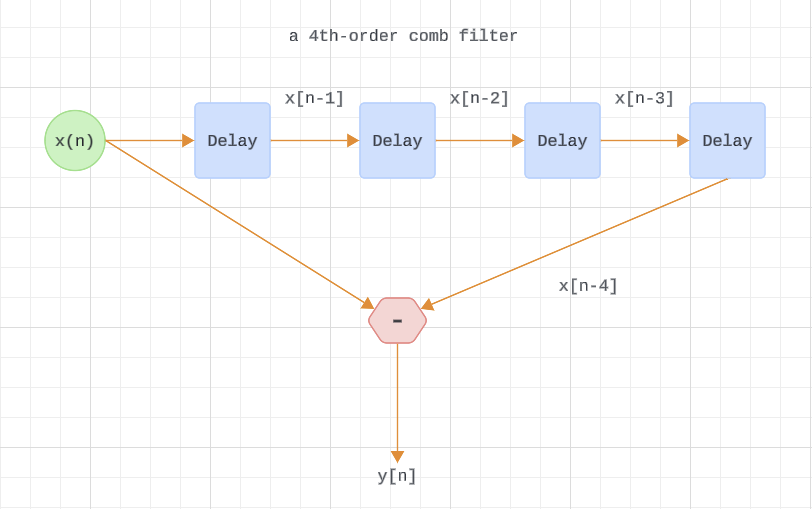

(b) an integrator: $y_I(n) = x(n) + y_I(n–1)$,

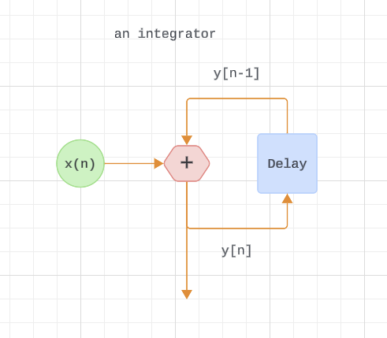

(c) a leaky integrator:
$y_{\text{LI}}(n) = Ax(n) + (1–A)y_{\text{LI}}(n–1)$
[the scalar value $A$ is a real-valued constant in the range
$0 <A<1$].

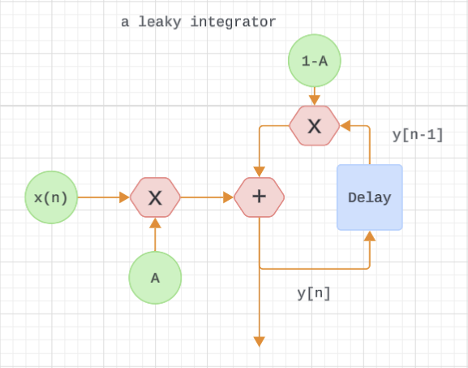

(d) a differentiator:

$$ 
y_D(n) = 0.5x(n) - 0.5x(n-2)
$$

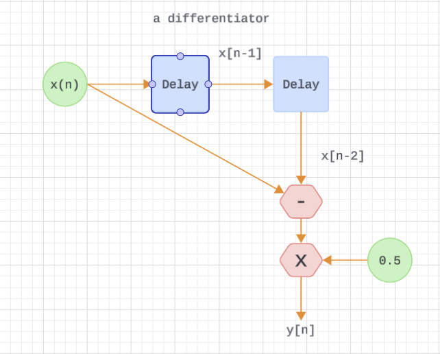

## 1.21

Draw the unit impulse responses (the output sequences when the 
input is a unit sample impulse applied at time $n=0$) of the 
four processes listed in Problem 1.20. Let $A = 0.5$ for the 
leaky integrator. Assume that all sample values within the systems are zero at time $n = 0$.

(a)

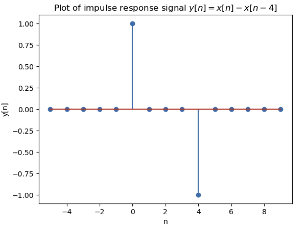

(b)

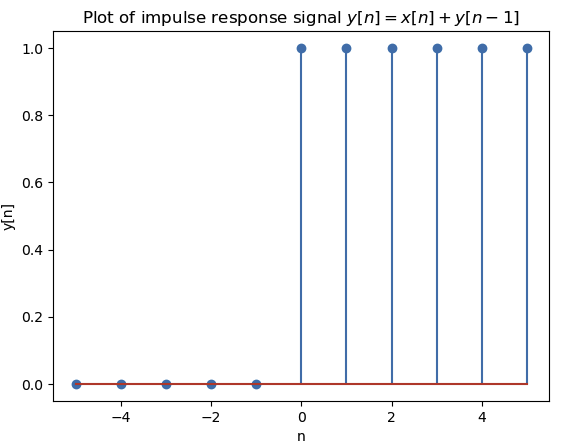

(c)

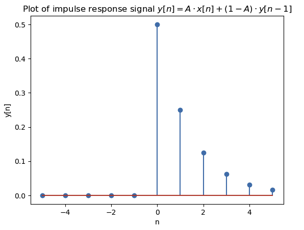

(d)

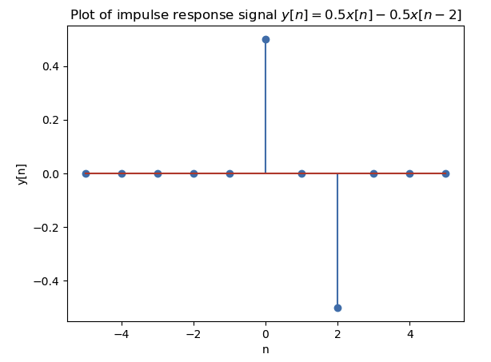

## 1.22

DSP engineers involved in building control systems often need 
to know what is the step response of a discrete system. The 
step response, $y_{\text{step}}(n)$, can be defined in two equivalent ways.

* One way is to say that $y_{\text{step}}(n)$ is a system’s
  response to an input sequence of all unity-valued samples.
* A second definition is that $y_{\text{step}}(n)$ is the 
  cumulative sum (the accumulation, discrete integration) of 
  that system’s unit impulse response $y_{\text{imp}}(n)$.

Algebraically, this second definition of step response is 
expressed as

$$ 
y_{\text{step}}(n) =
\sum_{k = -\infty }^{n}
y_{\text{imp}}(k)
$$

In words, the above $y_{\text{setp}}(n)$ expression tells us: 
“The step response at time index $n$ is equal to the sum of 
all the previous impulse response samples up to and including
$y_{\text{imp}}(k)$."
With that said, what are the step responses of the
four processes listed in Problem 1.20? (Let $A = 0.5$ for the 
leaky integrator.) Assume that all sample values within the 
system are zero at time $n=0$.

(a)

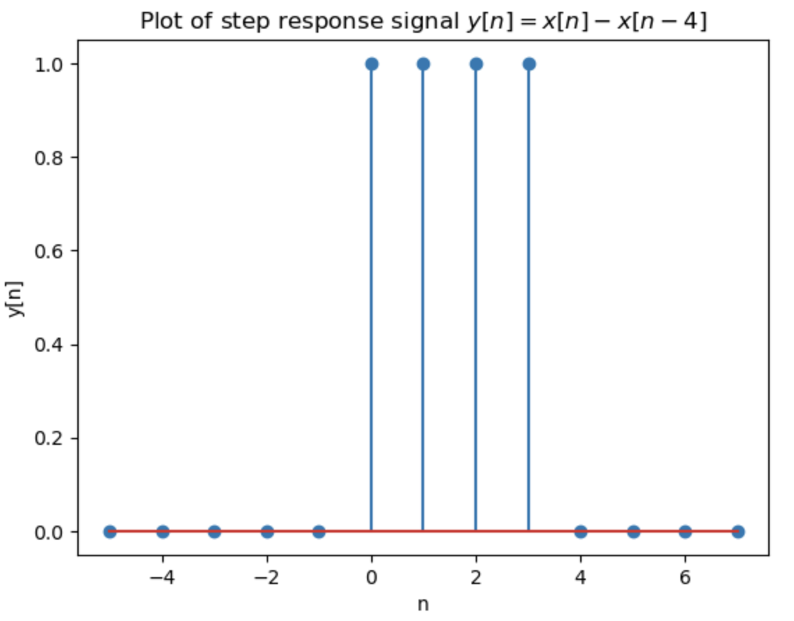

(b)

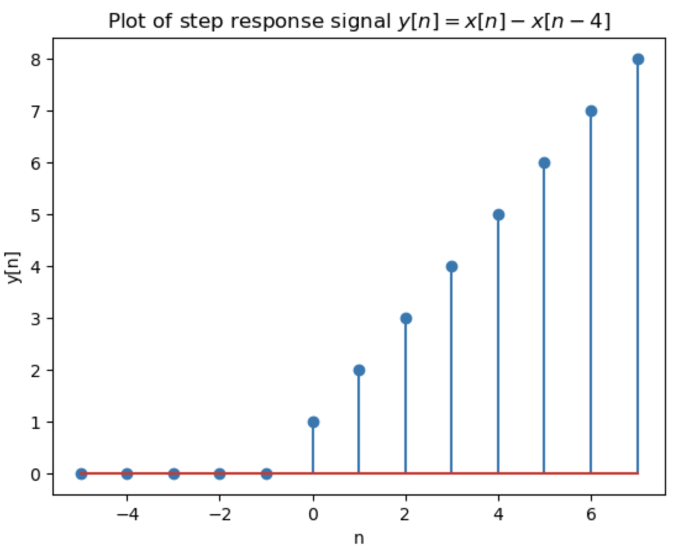

(c)

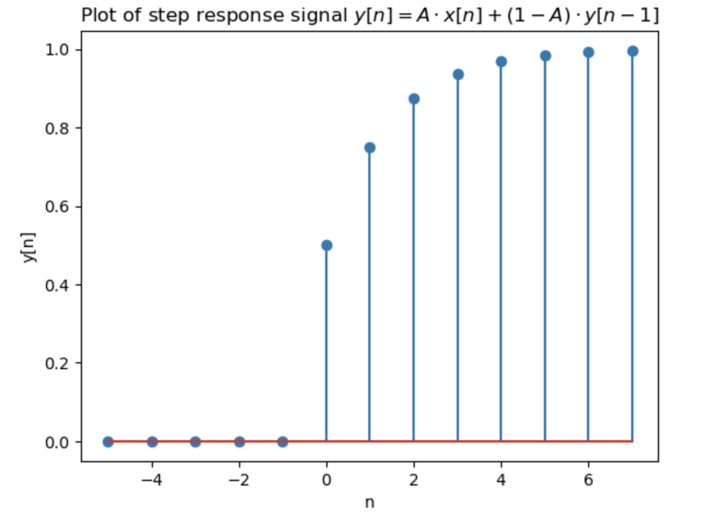

(d)

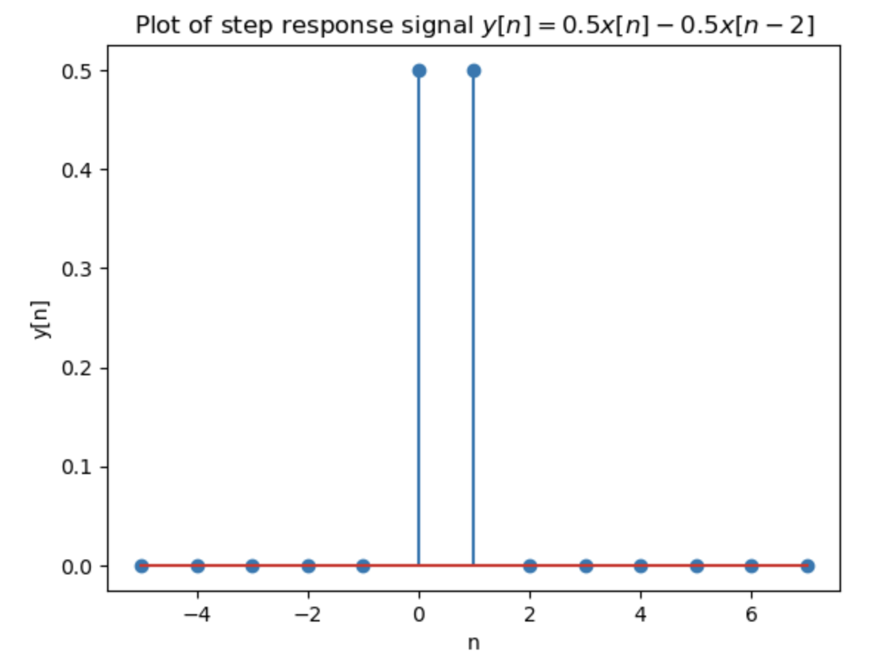

## 1.23

Thinking about the spectra of signals, the ideal continuous 
(analog) square-wave $s(t)$ in Figure P1–23, whose fundamental 
frequency is $f_o$ Hz, is equal to the sum of an $f_o$ Hz 
sinewave and all sinewaves whose frequencies are odd multiples 
of $f_o$ Hz. 

We call $s(t)$ “ideal” because we assume the amplitude tran-
sitions from plus and minus A occur instantaneously (zero seconds!).
Continuous Fourier analysis of the $s(t)$ squarewave allows us 
to describe this sum of frequencies as the following infinite 
sum:

$$ 
s(t) =
\frac{4A}{\pi }
\left[ 
\sin (2 \pi f_o t) +
\frac{6 \pi f_o t}{3} +
\frac{10 \pi f_o t}{5} +
\frac{14 \pi f_o t}{7} +
\cdots
\right] 
$$

Using a summation symbol, we can express squarewave $s(t)$ 
algebraically as

$$ 
s(t) =
\frac{4A}{\pi }
\sum_{n = 1}^{\infty}
\sin (2 \pi (2n-1) f_o t) / (2n-1)
$$

Answer:

(a) Imagine applying s(t) to a filter that completely removes
$s(t)$’s lowest-frequency spectral component. Draw the 
time-domain waveform at the output of such a filter.

**Solution**:

Removing $s(t)$’s lowest-frequency spectral component means

$$ 
s'(t) =
\frac{4A}{\pi }
\sum_{n = 2}^{\infty}
\sin (2 \pi (2n-1) f_o t) / (2n-1)
$$

The code:

```python
# 1.23

t = np.arange(-2, 4, 0.01)
A = 1
y = np.zeros_like(t)
start = 3
end = 10
for k in range(start, end, 2):
    y = y + np.sin(2 * np.pi * k * t) / k
y = 4 * A / (np.pi) * y
plt.xlabel('t');
plt.ylabel(r'y');
plt.title(r'Plot of s(t) w/o lowest-freq. component.');
plt.plot(t, y);
```

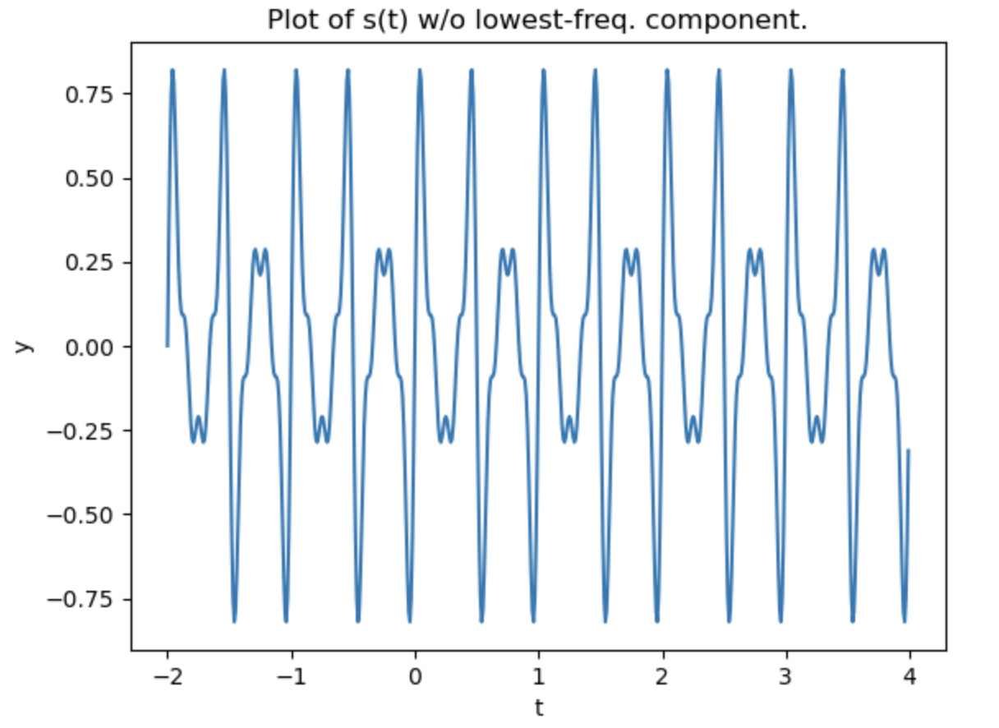

(b) Assume $s(t)$ represents a voltage whose fo fundamental 
frequency is 1 Hz, and we wish to amplify that voltage to peak 
amplitudes of ±2A. Over what frequency range must an amplifier 
operate (that is, what must be the amplifier’s passband width) 
in order to exactly double the ideal 1 Hz squarewave’s 
peak-peak amplitude?

**Solution**: Since the ideal squarewave has frequency
components for $1, 2, \cdots, N, \cdots$ Hz, then the
passband width has to be infinite.

$\square$

## 1.24

This interesting problem illustrates an illegal mathematical 
operation that we must learn to avoid in our future algebraic 
activities. The following claims to be a mathematical proof 
that $4 = 5$. Which of the following steps is illegal? Explain 
why.

Proof that $4 = 5$:

Step 1: $16 – 36 = 25 – 45$

Step 2: $42 – 9 · 4 = 52 – 9 · 5$

Step 3: $42 – 9 · 4 + 81/4 = 52 – 9 · 5 + 81/4$

Step 4: $(4 – 9/2)^2 = (5 – 9/2)^2$

Step 5: $4 – 9/2 = 5 – 9/2$

Step 6: $4 = 5$

**Solution**: From step 4 to step 5 is illegal.
In general, if $r^2 = s^2$, it's possible that
$r = -s$.

$\square$
