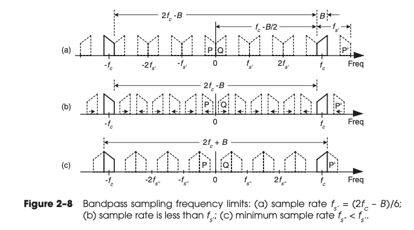
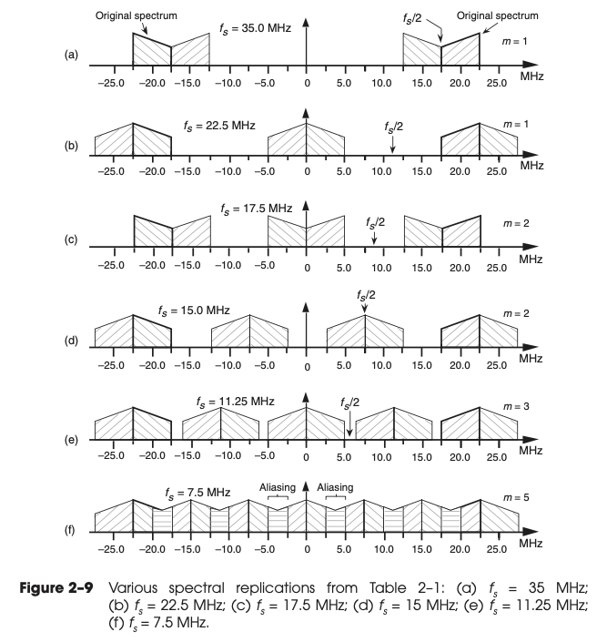

# Chapter 02 Periodic Sampling

* Our primary concern is just how fast a given continuous signal
  must be sampled in order to preserve its information content.

## 2.1 ALIASING: SIGNAL AMBIGUITY IN THE FREQUENCY DOMAIN

If a signal can be defined by

$$ 
\tag{2-1}
x(t) = \sin (2 \pi f_o t)
$$

and

$$ 
\tag{2-2}
x(n) = \sin (2 \pi f_o n t_s)
$$

Then we can have

$$ 
\tag{2-3}
x(n) = \sin (2 \pi f_o n t_s)
= \sin (2 \pi f_o n t_s + 2 \pi m)
= \sin (2 \pi (f_o + \frac{m}{n t_s}) n t_s )
$$

So if we consider a sine wave with frequency of $f_o + k f_s, k \in \mathbb{Z}$, then

$$
\tag{2-5}
x'(n) = \sin (2 \pi (f_o + k f_s) t_s) = \sin (2 \pi f_o n t_s + 2 \pi k)
= \sin (2 \pi f_o n t_s) = x(n)
$$

When sampling at a rate of $f_s$ samples/second, if $k$ is any positive or negative
integer, we cannot distinguish between the sampled values of a sinewave of
$f_o$ Hz and a sinewave of $(f_o + kf_s)$ Hz.

The frequency $f_s / 2$ is an important quantity in sampling theory and is referred to by 
different names in the literature, such as critical Nyquist, half Nyquist, and folding
frequency.

## 2.2 SAMPLING LOWPASS SIGNALS

If we reduce the $f_s = 1.5 B < 2 B$, the we see the lower edge and upper edge of the
spectral replications centered at $+f_s$ and $–f_s$ now lie in our band of interest.
The spectral information in the bands of $–B$ to $–B/2$ and
$B/2$ to $B$ Hz has been corrupted.

The entire spectral content of the original continuous signal is now residing in the band
of interest between $–f_s/2$ and $+f_s/2$.
This key property was true in Figure 2–4(b) and will always be true, regardless of the 
original signal or the sample rate.

This problem is solved in practice by using an analog low-pass anti-aliasing filter prior to
A/D conversion to attenuate any unwanted
signal energy above $+B$ and below $–B$ Hz as shown in Figure 2–6.

## 2.3 SAMPLING BANDPASS SIGNALS

Use the following figure, we can derive the relation between $f_s$ and $f_c$.

From (a) it's

$$ 
2 f_c - B = m f_s
$$

From (b) it's

$$ 
2 f_c + B = (m + 1) f_s
$$

And also $f_s \geq 2B$, so overall

$$ 
\frac{2 f_c + B}{m + 1} \leq f_s \leq \frac{2 f_c - B}{m}
$$

The figure 2-9 is interesting.

## 2.4 PRACTICAL ASPECTS OF BANDPASS SAMPLING
