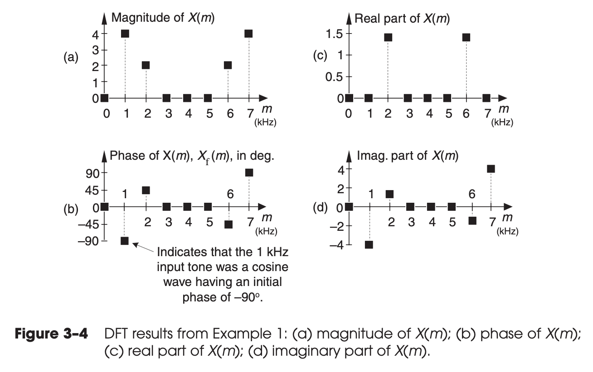
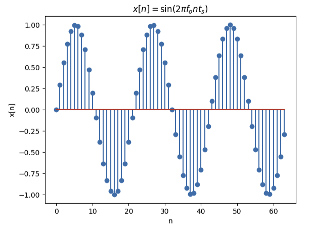
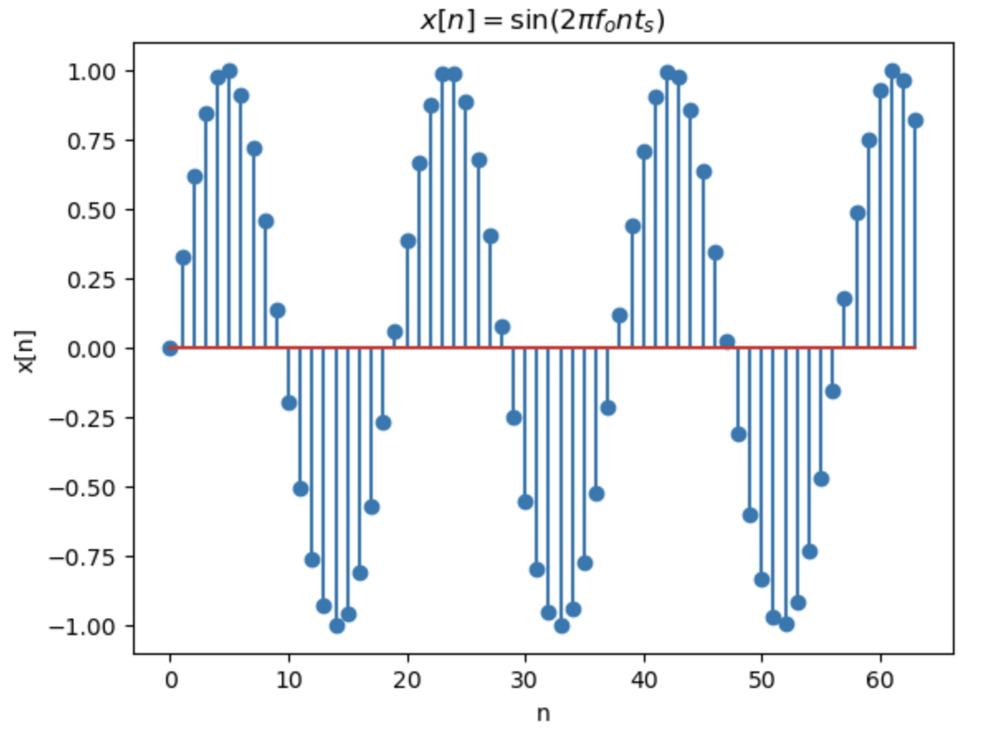
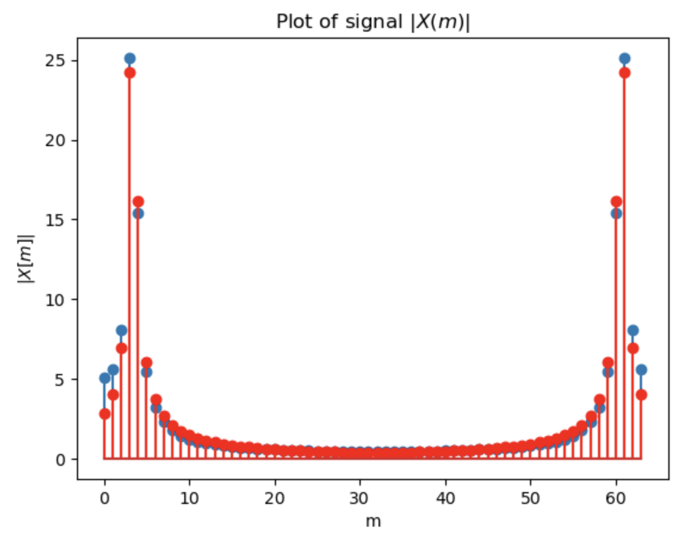
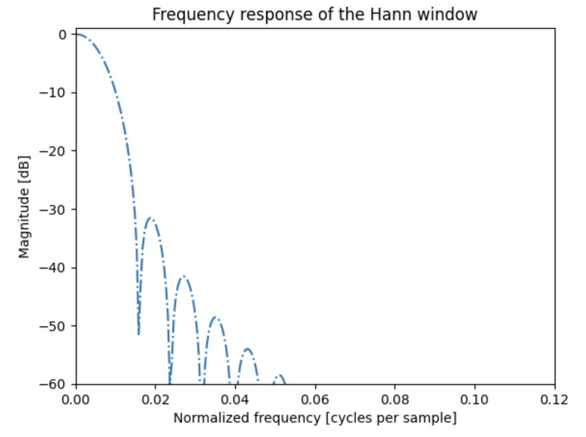
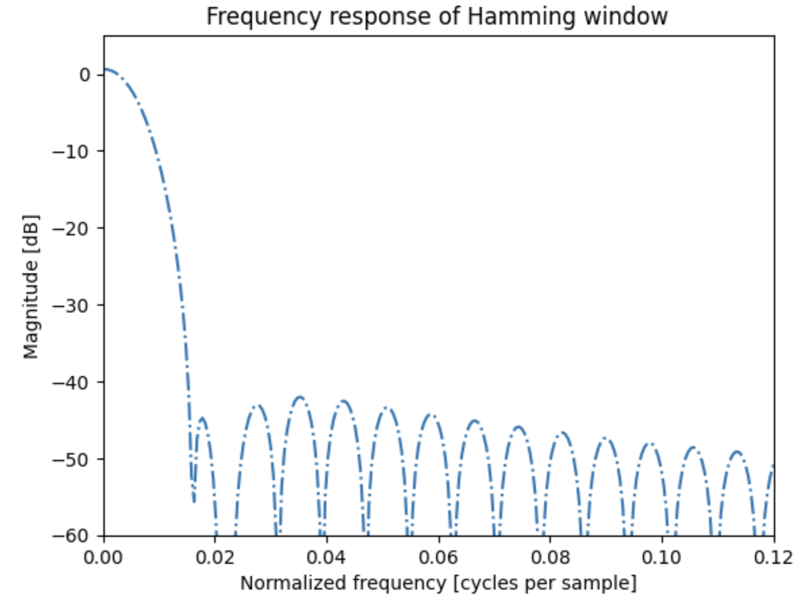
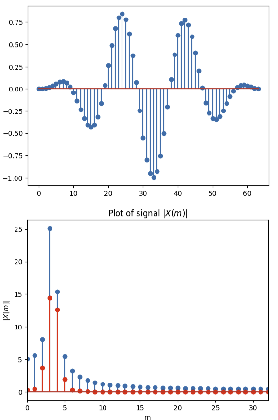
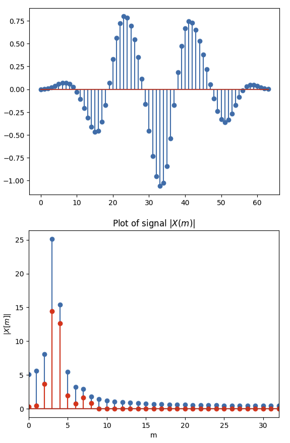
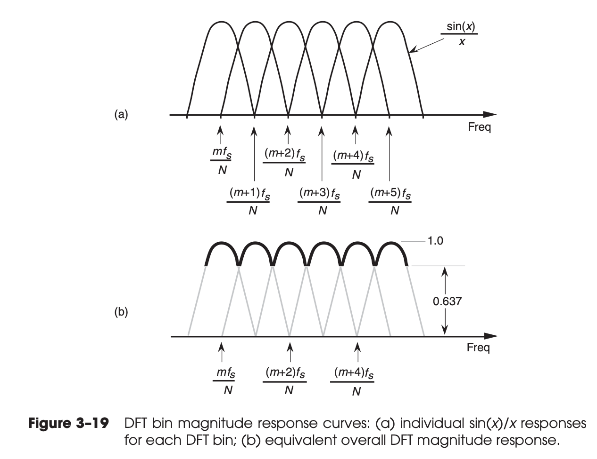

# Chapter 03 The Discrete Fourier Transform

* The discrete Fourier transform (DFT) is one of the two most common, and 
  powerful, procedures encountered in the field of digital signal processing.
  (Digital filtering is the other.)

Continuous Fourier Transform

$$ 
\tag{3-1}
X(f) =\int_{-\infty }^{+\infty}
x(t) e^{-j2πft} dt
$$

> A prominent quote from Lord Kelvin better states this sentiment: 
> “Fourier’s theorem is not only one of the most beautiful results 
> of modern analysis, but it may be said to furnish an 
> indispensable instrument in the treatment of nearly every 
> recondite question in modern physics.

DFT equation (exponential form):

$$
\tag{3-2}
X(m) = \sum_{n = 0}^{N-1} x(n) e^{-j2πnm/N}
$$

## 3.1 UNDERSTANDING THE DFT EQUATION

DFT equation (rectangular form):

$$
\tag{3-3}
X(m) = \sum_{n = 0}^{N-1} x(n) [\cos (2πnm/N) -j \sin (2πnm/N)]
$$

* $X(m) =$ the $m$th DFT output component
    * $m =$ the index of the DFT output in the frequency domain.
    * $m = 0, 1, 2, 3, . . ., N–1$.
* $x(n) =$ the sequence of input samples
    * $n =$ the time-domain index of the input samples.
    * $n = 0, 1, 2, 3, . . ., N–1$.
* $N =$ the number of samples of the input sequence and the number 
  of frequency points in the DFT output.
    * The value $N$ is an important parameter because it determines 
      how many input samples are needed, the resolution of the 
      frequency-domain results, and the amount of processing time
      necessary to calculate an $N$-point DFT.

* The exact frequencies of the different sinusoids depend on both 
  the sampling rate $f_s$ at which the original signal was sampled, and the number of samples $N$.
* For example, if we are sampling a continuous signal at a rate of 
  500 samples/second and, then, perform a $16$-point DFT on the 
  sampled data, the fundamental frequency of the sinusoids is
  $f_s/N = 500/16$ or $31.25$ Hz.

The $N$ separate DFT analysis frequencies are

$$
\tag{3-5}
f_{\text{analysis}}(m) = \frac{m f_s}{N}.
$$

### The magnitude

$$ 
\tag{3-6}
X(m) = X_\text{real} + j X_{\text{imag}}
$$

Then the magnitude of $X(m)$ is

$$ 
\tag{3-7}
X_{\text{mag}} = |X(m)| = \sqrt[]{X_{\text{real}}(m)^2 + X_{\text{imag}}(m)^2}
$$

### 3.1.1 DFT Example 1

Consider performing an 8-point DFT on a continuous input signal containing
components at 1 kHz and 2 kHz a input signal:

$$ 
x_{in}(t) = \sin(2π⋅1000⋅t) + 0.5\sin(2π⋅2000⋅t+3π/4)
$$

And we use $f_s = 8000$ samples/second.

Then

$$ 
x(n) = \sin(2π⋅1000⋅n⋅t_s) + 0.5\sin(2π⋅2000⋅n⋅t_s+3π/4),
\quad
t_s = \frac{1}{8000}
$$

our eight $x(n)$ samples are:

```python
from scipy.fft import fft, fftfreq
import numpy as np

fs = 8000  # Sampling rate in Hz
n = np.arange(0, 8, 1)  # Time vector
ts = 1.0 / fs
# Signal with 1000 Hz and 2000 Hz components
x = 1.0*np.sin(2*np.pi*1000*n*ts) + 0.5*np.sin(2*np.pi*2000*n*ts + (3/4)*np.pi)

x
array([ 0.35355339,  0.35355339,  0.64644661,  1.06066017,
0.35355339, -1.06066017, -1.35355339, -0.35355339])
```

We can either use `scipy.fft` or manual:

```python
X = fft(x)
np.around(X,4)

array([ 0.    -0.j    , -0.    -4.j    ,  1.4142+1.4142j,
0.    +0.j    ,-0.    -0.j    ,  0.    -0.j    ,  1.4142-1.4142j, -0.    +4.j    ])

N = 8
Y = np.array([0+0*1j]*N)
for m in range(N):
    Y[m] = 0 + 0*1j
    for n in range(N):
        Y[m] = Y[m] + x[n] * (np.cos(-2*np.pi*n*m/N) + 1j*np.sin(-2*np.pi*n*m/N))

np.around(Y,4)

array([ 0.    +0.j    , -0.    -4.j    ,  1.4142+1.4142j,
0.    -0.j    , -0.    -0.j    ,  0.    +0.j    ,  1.4142-1.4142j, -0.    +4.j    ])

np.allclose(X, Y)

True
```



We have the following observations from this figure:

* By looking at the $|X(m)|$, we can see, $|X(0)| = 0$, that means
$x(n)$ has no DC component.

* Looking at Figure 3–4(b), we might notice that the phase of
  $X(1)$ is $–90$ degrees. It compares against a $\cos$ wave at
  frequency $\frac{m f_s}{N}$.
    * At the frequency $1 f_s / N = 8000 / 8 = 1000$, the phase is
      $-90$, which corresponds to $\sin(2π⋅1000⋅t)$. This is
      correct, because $\cos (2π⋅1000⋅t - 90) = \sin (2π⋅1000⋅t)$.
    * At the frequency $2 f_s / N = 8000 / 8 = 2000$, the phase is
      $+45$, which corresponds to $\sin(2π⋅2000⋅t + 3/4 \pi)$. 
      This is correct, because $\cos \theta = \sin (\theta + \pi / 2)$, so $\cos (2π⋅1000⋅t + 45) = \sin 
      (2π⋅1000⋅t + 45 + 90)$.

* 2 open questions:
    * What are the components when $m = 6, 7$.
    * Why the max magnitude is $4$ instead of $1$.

> 2 very important characteristics of the DFT that we should never forget.
* any individual $X(m)$ output value is nothing more than the sum 
  of the term-by-term products, a correlation, of an input signal 
  sample sequence with a cosine and a sinewave whose frequencies 
  are $m$ complete cycles in the total sample interval of $N$ 
  samples. This is true no matter what the $f_s$ sample rate is 
  and no matter how large $N$ is in an $N$-point DFT.
* The second important characteristic of the DFT of real input 
  samples is the symmetry of the DFT output terms.

### 3.2 DFT SYMMETRY

Consider $x(n)$ is a real signal. Using equation (3-2), we have

$$
\begin{split}
X(N-m)
&= \sum_{n = 0}^{N-1} x(n) e^{-j2πn(N-m)/N} \\
&= \sum_{n = 0}^{N-1} x(n) e^{-j2πn} e^{j2πnm/N} \\
&= \sum_{n = 0}^{N-1} x(n) e^{j2πnm/N} \\
&= \left(\sum_{n = 0}^{N-1} x(n) e^{-j2πnm/N}\right)^*  \\
&= (X(m))^* \\
\end{split}
$$

* If that real input function is even, then $X(m)$ is
  always real and even.
* If the real input function is odd, then $X(m)$ is always
  pure imaginary.

### 3.3 DFT LINEARITY

$$
\begin{split}
X_1(m) + X_2(m)
&= \sum_{n = 0}^{N-1} x_1(n) e^{-j2πnm/N}
+ \sum_{n = 0}^{N-1} x_2(n) e^{-j2πnm/N} \\
&= \sum_{n = 0}^{N-1} (x_1(n) + x_2(n)) e^{-j2πnm/N} \\
&= X_{\text{sum}}(m)
\end{split}
$$

## 3.4 DFT MAGNITUDES

* When a real input signal contains a sinewave component,
  whose frequency is less than half the $f_s$ sample rate, of peak 
  amplitude $A_o$ with an integral number of cycles over $N$ input samples, the output magnitude of the DFT for that particular sinewave is $M_r$ where

$$
\tag{3-17}
M_r = \frac{A_o N}{2}
$$

* If the DFT input is a complex sinusoid of magnitude $A_o$ (i.e., 
  $A_o e^{j2πfnt_s}$) with an integer number of cycles over $N$
  samples, the $M_c$ output magnitude of the DFT for that 
  particular sinewave is

$$ 
\tag{3-17'}
M_c = A_o N
$$

The other 2 forms of DFT

$$
\tag{3-18}
X'(m) = \frac{1}{N} \sum_{n = 0}^{N-1} x(n) e^{-j2πnm/N}
$$

Or

$$
\tag{3-18'}
X'(m) = \frac{1}{\sqrt[]{N}} \sum_{n = 0}^{N-1} x(n) e^{-j2πnm/N} \\
x'(n) = \frac{1}{\sqrt[]{N}} \sum_{m = 0}^{N-1} X(m) e^{j2πnm/N} \\
$$

## 3.5 DFT FREQUENCY AXIS

* Just remember that the DFT’s frequency spacing (resolution) is 
  $f_s/N$.

> * Each DFT output term is the sum of the term-by-term products of an
input time-domain sequence with sequences representing a sine and a
cosine wave.
> * For real inputs, an $N$-point DFT’s output provides only $N/2+1$ independent terms.
> * The DFT is a linear operation.
> * The magnitude of the DFT results is directly proportional to $N$.
> * The DFT’s frequency resolution is $f_s/N$.

## 3.6 DFT SHIFTING THEOREM

Consider $x'(n) = x(n+k), x(n) = x(n+N), 0 \leq k < N$ and

$$
\tag{3-19}
\begin{split}
X'(m) 
&= \sum_{n = 0}^{N-1} x'(n) e^{-j2πnm/N} \\
&= \sum_{n = 0}^{N-1} x(n+k) e^{-j2πnm/N} \\
&= e^{j2πkm/N} \sum_{n = 0}^{N-1} x(n+k) e^{-j2π(n+k)m/N} \\
&= e^{j2πkm/N} \sum_{l = k}^{N-1+k} x(l) e^{-j2πlm/N} \\
&= e^{j2πkm/N} \sum_{l = 0}^{N-1} x(l) e^{-j2πlm/N} \\
\end{split}
$$

$\square$

### 3.6.1 DFT Example 2

We still use the same example in 3.1.1

$$
x_{in}(t) = \sin(2π⋅1000⋅t) + 0.5\sin(2π⋅2000⋅t+3π/4)
$$

And let $x'(n) = x(n+3)$, here is the python code

```python
from scipy.fft import fft, fftfreq
import numpy as np

fs = 8000  # Sampling rate in Hz
n = np.arange(0, 8, 1)  # Time vector
ts = 1.0 / fs
# Signal with 1000 Hz and 2000 Hz components
x = 1.0*np.sin(2*np.pi*1000*n*ts) + 0.5*np.sin(2*np.pi*2000*n*ts + (3/4)*np.pi)

x_1 = np.roll(x, -3)
x_1

array([ 1.06066017,  0.35355339, -1.06066017, -1.35355339, -0.35355339, 0.35355339,  0.35355339,  0.64644661])

X_1 = fft(x_1)
np.around(X_1,4)

array([ 0.    -0.j    ,  2.8284+2.8284j,  1.4142-1.4142j, -0.    +0.j    ,
        0.    -0.j    , -0.    -0.j    ,  1.4142+1.4142j,  2.8284-2.8284j])

X_2 = np.array([0+0*1j]*N)
for m in range(N):
    X_2[m] = np.exp(1j * 2 * np.pi * 3 * m / N) * X[m]
np.around(X_2,4)

array([ 0.    +0.j    ,  2.8284+2.8284j,  1.4142-1.4142j, -0.    +0.j    ,
        0.    -0.j    , -0.    -0.j    ,  1.4142+1.4142j,  2.8284-2.8284j])

np.allclose(X_1, X_2)
True
```

$\square$

## 3.7 INVERSE DFT

$$
\tag{3-23}
x(n) = \frac{1}{N} \sum_{m = 0}^{N-1} x(m) e^{j2πmn/N}
$$

$$
\tag{3-23'}
x(n) = \frac{1}{N} \sum_{m = 0}^{N-1} X(m) [\cos (2πmn/N) + j \sin(2πmn/N)]
$$

Here is the python code to implement it

```python
from scipy.fft import fft, fftfreq, ifft
import numpy as np

fs = 8000  # Sampling rate in Hz
n = np.arange(0, 8, 1)  # Time vector
ts = 1.0 / fs
# Signal with 1000 Hz and 2000 Hz components
x = 1.0*np.sin(2*np.pi*1000*n*ts) + 0.5*np.sin(2*np.pi*2000*n*ts + (3/4)*np.pi)

X = fft(x)
x_ifft = ifft(X)
np.around(x_ifft,4)

array([ 0.3536+0.j,  0.3536+0.j,  0.6464+0.j,  1.0607+0.j,  0.3536+0.j,
       -1.0607+0.j, -1.3536-0.j, -0.3536+0.j])

Y_inv = np.array([0+0*1j]*N)
for m in range(N):
    Y_inv[m] = 0 + 0*1j
    for n in range(N):
        Y_inv[m] = Y_inv[m] + (1 / N) * X[n] * (np.cos(2*np.pi*n*m/N) + 1j*np.sin(2*np.pi*n*m/N))
np.around(Y_inv, 4)

array([ 0.3536+0.j,  0.3536+0.j,  0.6464+0.j,  1.0607+0.j,  0.3536+0.j,
       -1.0607+0.j, -1.3536-0.j, -0.3536+0.j])

np.allclose(x_ifft, Y_inv)
True
```

$\square$

## 3.8 DFT LEAKAGE

For a real cosine input having
$k$ cycles ($k$ need not be an integer) in the $N$-point input 
time sequence, the amplitude response of an $N$-point DFT bin in 
terms of the bin index $m$ is approximated by the sinc function

$$
\tag{3-25}
X(m) = \frac{A_o N}{2}
\frac{\sin [\pi (k-m)]}{\pi (k-m)}
$$

The python code to plot the signal.

Note we set the frequency of the sine wave to be
$$ 
f_o = 1000 \times k
$$

So when sampling frequency is $64000$, 64 samples will have
$k$ cycles.

Let's first plot when $k = 3$, i.e. 3 full periods over 64 samples.

```python
# exactly 3 periods over 64 samples
N  = 64
n  = np.arange(0, N, 1)
fs = 1000 * 64  # Sampling rate in Hz
fo = 1000 * 3   # 3 full cycles for 64 samples
ts = 1.0 / fs
x  = 1.0*np.sin(2*np.pi*fo*n*ts)

plt.xlabel('n');
plt.ylabel('x[n]');
plt.title(r'$x[n] = \sin (2\pi f_o n t_s)$');
plt.stem(n, x);
```



Next, we will plot when $k = 3.4$, i.e. 3.4 full cycles for 64 
samples.

```python
k = 16.4
k = 28.6
k = 3.4
fo = 1000 * k   # 3.4 full cycles for 64 samples
x  = 1.0*np.sin(2*np.pi*fo*n*ts)

plt.xlabel('n');
plt.ylabel('x[n]');
plt.title(r'$x[n] = \sin (2\pi f_o n t_s)$');
plt.stem(n, x);
```



Finally, we will plot the DFT and use $sinc$ function to
approximate the magnitude.

```python
X = fft(x)
plt.xlabel('m');
plt.ylabel(r'$|X[m]|$');
plt.title(r'Plot of signal $|X(m)|$');
X_m = np.absolute(X)
plt.stem(n, X_m)

X_sinc = np.zeros_like(X_m)
for m in range(N):
    if m >= N // 2:
        X_sinc[m] = np.absolute(N / 2 * np.sinc((k - (N - m))))
    else:
        X_sinc[m] = np.absolute(N / 2 * np.sinc((k - m)))

plt.stem(n, X_sinc, 'r')
```



As we can see use $\text{sinc} (k-m) = \frac{\sin [\pi (k-m)]}{\pi (k-m)}$ can only approximate the amplitude, but not
exactly match.

* Note here in the python code, since $A_o = 1$,
so $\frac{A_oN}{2} = \frac{N}{2}$.
* Also note here we use the property that if $x[n]$ is real,
then $|X(m)| = |X(N-m)|$, that's why we have the `if-else`.

## 3.9 Windows

### Learning Objective

* Verify the square window is indeed `sinc` function in python.
* Verify the equation in the text book is same as the function
  in `scipy`.
* Plot the magnitude response of the window function.
* Verify the windows are indeed working, i.e. reduce leakage.

### Why do we use windows function

* We want to minimize the sidelobes of `sinc` function.
* The reason for DFT leakage is because the
  beginning and the end of the sample interval has a value jump.
  E.g., when we have 3.4 periods for 64 samples.
  So we need to make them smooth.
* When `N` samples are `m` (integer) periods, then beginning and the 
  end of the sample interval are smooth. Otherwise they have a jump.

### The Fourier transform of square function

* Consider the following window function

$$ 
f(t) =
\begin{cases}
    0,  & -\frac{1}{2} \leq t < -\frac{1}{4} \\
    +1, & -\frac{1}{4} \leq t \leq +\frac{1}{4} \\
    0,  & +\frac{1}{4} < t \leq \frac{1}{2}
\end{cases}
$$

Compute

$$
\begin{split}
\hat{f}(n)
&= \int_{-1/2}^{1/2} e^{-2πint} f(t) dt \\
&= \int_{-1/4}^{1/4} e^{-2πint} \cdot 1 dt \\
&= -\frac{1}{2πin} e^{-2πint} \bigg|_{-1/4}^{1/4} \\
&= -\frac{1}{2πin} \left[ e^{-πin/2} - e^{πin/2} \right] \\
&= \frac{1}{2πin} \left[ e^{πin/2} - e^{-πin/2} \right] \\
&= \frac{1}{2πin} 2i \sin (πn/2) \\
&= \frac{\sin (πn/2)}{πn} \\
&= \frac{\text{sinc}(πn/2)}{2} \\
\end{split}
$$

Also $\hat{f}(0) = 1/2$.

$\square$

### The window function

$$ 
\tag{3-26}
X(m) = \sum_{n = 0}^{N-1} w(n) x(n) e^{-j2πnm/N} 
$$

* Hamming, Hanning, and triangular windows reduce the time-domain signal levels applied to the DFT.
    * They reduced sidelobe levels relative to the rectangular window.
    * Their main lobe peak values are reduced relative to the rectangular window.

This is how to genenerate hanning window, note that we are using the `N-1` instead of `N`
`np.cos(2 * np.pi * n / (N-1))`.

> This makes me think when we perform 16-point `fft`, we should generate a hanning window of $N=17$.
And then use the first 16-point to multiply the sampled data. 

```python
# https://numpy.org/doc/stable/reference/generated/numpy.hanning.html
N = 16

window = np.hanning(N)
print(len(window))
print(f'window is: {window}')

n  = np.arange(0, N, 1)
print(n)
window_manual = 0.5 - 0.5 * np.cos(2 * np.pi * n / (N-1))
print(f'window_manual is: {window_manual}')

np.allclose(window, window_manual)
True
```

Similarly, this is how to generate hamming window using `numpy` or manually.

```python
# https://numpy.org/doc/stable/reference/generated/numpy.hamming.html

N = 16
n  = np.arange(0, N, 1)
window = np.hamming(N)
print(f'window is: {window}')
window_manual = 0.54 - 0.46 * np.cos(2 * np.pi * n / (N-1))
np.allclose(window, window_manual)
```

### The magnitude response of the window function

* Hanning

```python
# https://numpy.org/doc/stable/reference/generated/numpy.hanning.html
N = 128

import matplotlib.pyplot as plt
from numpy.fft import fft, fftshift
window = np.hanning(N)
plt.plot(window)
plt.title("Hann window")
plt.ylabel("Amplitude")
plt.xlabel("Sample")
plt.show()

plt.figure()
A = fft(window, 2048) / (N / 2)
mag = np.abs(fftshift(A))
freq = np.linspace(-0.5, 0.5, len(A))
with np.errstate(divide='ignore', invalid='ignore'):
    response = 20 * np.log10(mag)
response = np.clip(response, -100, 100)
plt.plot(freq, response, '-.')
plt.title("Frequency response of the Hann window")
plt.ylabel("Magnitude [dB]")
plt.xlabel("Normalized frequency [cycles per sample]")
plt.axis('tight')
plt.xlim([0, 0.12])
plt.ylim([-60, 1])
plt.show()
```



* Hamming

```python
# https://numpy.org/doc/stable/reference/generated/numpy.hamming.html

window = np.hamming(N)
plt.plot(window)
plt.title("Hamming window")
plt.ylabel("Amplitude")
plt.xlabel("Sample")
plt.show()
plt.figure()
A = fft(window, 2048) / (N/2)
mag = np.abs(fftshift(A))
freq = np.linspace(-0.5, 0.5, len(A))
response = 20 * np.log10(mag)
response = np.clip(response, -100, 100)
plt.plot(freq, response, '-.')
plt.title("Frequency response of Hamming window")
plt.ylabel("Magnitude [dB]")
plt.xlabel("Normalized frequency [cycles per sample]")
plt.axis('tight')
plt.xlim([0, 0.12])
plt.ylim([-60, 5])
plt.show()
```



### Apply window function

* We apply the hanning window function to the sine wave which
  has 3.4 cycles over 64 sampling points. 

```python
N  = 64
n  = np.arange(0, N, 1)
k = 3.4
fs = 1000 * 64  # Sampling rate in Hz
ts = 1.0 / fs
fo = 1000 * k   # 3.4 full cycles for 64 samples
x = 1.0*np.sin(2*np.pi*fo*n*ts)
plt.figure()
plt.stem(n, x * np.hanning(N + 1)[:N])

plt.figure()
X = fft(x)
plt.xlabel('m');
plt.ylabel(r'$|X[m]|$');
plt.xlim([0, 32])
plt.title(r'Plot of signal $|X(m)|$');
X_m = np.absolute(X)
plt.stem(n, X_m, 'o')

x_win = x * np.hanning(N + 1)[:N]
X_win = fft(x_win)
X_win_m = np.absolute(X_win)
plt.stem(n, X_win_m, 'r')
```



* If we use the following input signal, we can see that
  by applying the hanning window, it's much easier to
  spot the $m = 7$ component. 

```python
N  = 64
n  = np.arange(0, N, 1)
k = 3.4
fs = 1000 * 64  # Sampling rate in Hz
ts = 1.0 / fs
fo = 1000 * k   # 3.4 full cycles for 64 samples
fo1 = 1000 * 7  # 7.0 full cycles for 64 samples
x = 1.0*np.sin(2*np.pi*fo*n*ts) + 0.1*np.sin(2*np.pi*fo1*n*ts)
```



## 3.10 DFT Scalloping loss

* If we superinterpose several $\frac{\sin (x)}{x}$,
  we get the following diagram.
* The gain in the middle is $0.637$, so

$$ 
20 \log_{10} \frac{0.637}{1.0} = -3.9 \approx -4 \text{ db}
$$



* The scalloping loss of a Hanning window is approximately 0.82, or
  –1.45 dB, halfway between bin centers.

## 3.11 DFT RESOLUTION, ZERO PADDING, AND FREQUENCY-DOMAIN SAMPLING

### Learning Objective

* Plot the figure 3.21.

### Continuous Fourier Transform

* 