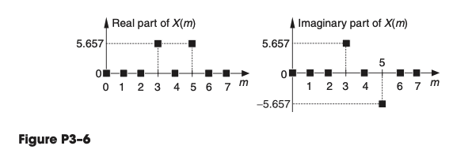
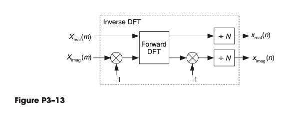

# Chapter 03 The Discrete Fourier Transform

## 3.1

Let’s assume that we have performed a 20-point DFT on a sequence 
of real-valued time-domain samples, and we want to send our $X(m)$ 
DFT results to a  colleague using e-mail. What is the absolute 
minimum number of (complex) frequency-domain sample values we will 
need to type in our e-mail so that our colleague has complete 
information regarding our DFT results?

**Solution**:

Since it is symmetric, we will just need send 10.

$\square$

## 3.2

Assume a systems engineer directs you to start designing a system 
that performs spectrum analysis using DFTs. The systems engineer 
states that the spectrum analysis system’s input data sample rate, 
$f_s$, is $1000$ Hz and specifies that the DFT’s frequency-domain sample spacing must be exactly $45$ Hz.

(a) What is the number of necessary input time samples, $N$, for a 
single DFT operation?

**Solution**:

If we want to achieve $45$ Hz, we know the DFT’s frequency spacing 
(resolution) is $f_s/N$.

So $f_s / N \leq 45$, then $N \geq 23$.

$\square$

(b) What do you tell the systems engineer regarding the spectrum 
analysis system’s specifications?

**Solution**:

The $f_s$ needs to be $900$ Hz.

$\square$

## 3.3

We want to compute an $N$-point DFT of a one-second-duration 
compact disc (CD) audio signal $x(n)$, whose sample rate is
$fs = 44.1$ kHz, with a DFT sample spacing of $1$ Hz.

(a) What is the number of necessary $x(n)$ time samples, $N$?

**Solution**: Again, we know the DFT’s frequency spacing 
(resolution) is $f_s/N$. So

$$ 
\frac{f_s}{N} = \frac{44100}{N} = 1
$$

Then $N = 441000$.

$\square$

(b) What is the time duration of the $x(n)$ sequence measured in 
seconds?
Hint: This Part (b) of the problem is trickier than it first 
appears. Think carefully.

**Solution**:

It should be

$$ 
1 \text{ second} \cdot \frac{44100 - 1}{44100} \approx 0.99997732
\text{ second}
$$

$\square$

## 3.4

Assume we have a discrete $x(n)$ time-domain sequence of samples 
obtained from lowpass sampling of an analog signal, $x(t)$.
If $x(n)$ contains $N = 500$ samples, and it was obtained at a 
sample rate of $f_s = 3000$ Hz:

(a) What is the frequency spacing of $x(n)$’s DFT samples, $X(m)$, 
measured in Hz?

**Solution**:

Again, it is

$$ 
\frac{f_s}{N} = \frac{3000}{500} = 6 \text{ Hz}
$$

$\square$

(b) What is the highest-frequency spectral component that can be 
present in the analog $x(t)$ signal where no aliasing errors occur 
in $x(n)$?

**Solution**:

The highest-frequency spectral component has to be $\leq \frac{f_s}
{2}$.

$\square$

(c) If you drew the full $X(m)$ spectrum and several of its 
spectral replications, what is the spacing between the spectral 
replications measured in Hz?

**Solution**:

I am not exactly sure. Let's say the original signal has the
frequency component of $1500 - 6 = 1494$ Hz. Then the spacing
between spectral replications is $(1500 + 6) - (1500-6) = 12$ Hz.

$\square$

## 3.5

What are the magnitudes of the 8-point DFT samples of

(a) the $x_1(n) = 9, 9, 9, 9, 9, 9, 9, 9$ sequence (explain how 
you arrived at your solution)?

**Solution**: We cannot apply the formula (3-17) because the
input does not contain a sine wave.

$$ 
M_r = \frac{A_o N}{2}
$$

So we have to directly use the FFT equation

$$ 
X(m) = \sum_{n = 0}^{N-1} x(n) e^{-j2πnm/N} \\
= 9 \sum_{n = 0}^{N-1} e^{-j2πnm/N} \\
=
\begin{cases}
    72 &\text{if } m = 0 \\
    0 &\text{if } m \neq 0 \\
\end{cases} 
$$

$\square$

(b) the $x_2(n) = 1, 0, 0, 0, 0, 0, 0, 0$ sequence (explain how 
you arrived at your solution)?

**Solution**:

$$ 
X(m) = \sum_{n = 0}^{N-1} x(n) e^{-j2πnm/N} \\
= x(0) = 1
$$

$\square$

(c) the $x_3(n) = 0, 1, 0, 0, 0, 0, 0, 0$ sequence (explain how 
you arrived at your solution)?

Because the $x_3(n)$ sequence in Part (c) is merely a time-shifted 
version of the $x_2(n)$ sequence in Part (b), comment on the 
relationship of the $|X_2(m)|$ and $|X_3(m)|$ DFT samples.

**Solution**:

Note $x_3(n) = x_2(n-1)$, so

$$ 
X_3(m) = e^{-j2πm/8} X_2(m)
$$

Then

$$ 
|X_3(m)| = |e^{-j2πm/8} X_2(m)| \\
= |X_2(m)| = 1
$$

$\square$

## 3.6

Consider sampling exactly three cycles of a continuous $x(t)$ 
sinusoid resulting
in an 8-point $x(n)$ time sequence whose 8-point DFT is the
$X(m)$ shown in Figure P3–6. If the sample rate used to obtain
$x(n)$ was 4000 Hz, write the time-domain equation for the 
discrete $x(n)$ sinusoid in trigonometric 
form. Show how you arrived at your answer.



**Solution**:

We can simply do a IDFT.
Note that $A = 8, X(3) = A e^{j(π/4)}, X(5) = A e^{-j(π/4)}$ 

$$
\begin{split}
x(n) &= \frac{1}{N} \sum_{m = 0}^{N-1} X(m) e^{j2πmn/N} \\
&= \frac{A}{8}
(e^{j(π/4 + 6πn/8)} + e^{-j(π/4 + 6πn/8)}) \\
&= \frac{A}{4}
\cos (\frac{3n+1}{4} \pi) \\
&= 2 \cos (\frac{3n+1}{4} \pi)
\end{split}
$$

The python code

```python
N = 8
n = np.arange(0, 8, 1)
A = 8
x = (A/4) * np.cos ((3*n+1)/4 * np.pi)
np.around(x, 4)

array([ 1.4142, -2.    ,  1.4142,  0.    , -1.4142,  2.    , -1.4142, -0.    ])

X = fft(x)
np.around(X, 4)

array([-0.    -0.j    , -0.    -0.j    , -0.    -0.j    ,  5.6569+5.6569j,
        0.    -0.j    ,  5.6569-5.6569j, -0.    +0.j    , -0.    +0.j    ])
```

$\square$

## 3.7

In the text’s Section 3.1 we discussed the computations necessary 
to compute the $X(0)$ sample of an $N$-point DFT. That $X(0)$ 
output sample represents the zero Hz (DC) spectral component of an 
$x(n)$ input sequence. Because it is the DC component, $X(0)$ is 
real-only and we’re free to say that an $X(0)$ sample always has 
zero phase. With that said, here are two interesting DFT problems:

(a) Given that an $N$-point DFT’s input sequence $x(n)$ is 
real-only, and $N$ is an even number, is there any value for $m$ 
(other than $m = 0$) for which an $X(m)$ DFT output sample is 
always real-only?

**Solution**

$$ 
X(m) = \sum_{n = 0}^{N-1} x(n) e^{-j2πnm/N} 
$$

If $N$ is an even number and $m = N / 2$, then

$$ 
e^{-j2πnm/N} = e^{-jπn} = \cos (πn) + i \sin (πn) = \pm 1
$$

Then $X(N/2)$ is real-only.

$\square$

(b) Given that $N$ is an odd number, is there any value for $m$ 
(other than $m = 0$) where an $X(m)$ DFT output sample is always 
real-only?

**Solution**:

From section 3.2, if that real input function is even, then $X(m)$ 
is always real and even.

$\square$

## 3.8

Using the following rectangular form for the DFT equation:

$$ 
X(m) = \sum_{n = 0}^{N-1} x(n) [\cos (2πnm/N) - j \sin(2πnm/N)] 
$$

$N$ is an even number, frequency $f_s$ is the $x(n)$ sequence’s sample 
rate in Hz, time index $n = 0, 1, 2, ..., N–1$, and $θ$ is an initial 
phase angle measured in radians.
Hint: Recall the trigonometric identity

$$
\sin(α+β) = \sin(α)\cos(β) + \cos(α)\sin(β)
$$.

(a) Prove that the $f_s/2$ spectral sample is $X(N/2) = N · \sin(θ)$ 
when the $x(n)$ input is a sinusoidal sequence defined by

$$ 
x(n) = \sin[2π(f_s/2)nt_s + θ].
$$

**Proof**:

First note that the original analog waveform frequency should be
$f_s / 2$.

Then note, when $m = N/2$, then

$$ 
\cos (2πnm/N) = \cos (n \pi) = \pm 1\\
\sin (2πnm/N) = \sin (n \pi) = 0 \\
$$

Then

$$
\begin{split}
X(N/2) &= x(0) - x(1) + \cdots + x(N-2) - x(N-1) \\
&= \sin (0π + θ) - \sin (1π + θ) + \cdots + \sin ((N-2)π + θ) -
\sin ((N-1)π + θ) \\
&= N \sin (θ)    
\end{split}
$$

Note that this is also intuitively correct, when $θ = 0$, and
we sample at $f_s$ for a $f_s/2$ sine wave, we can only get 0.

$\square$

(b) What is $X(N/2)$ when $x(n) = \sin[2π(f_s/2)nt_s]$?

**Solution**: As mentioned in the end of part (a), it's 0.

$\square$

(c) What is $X(N/2)$ when $x(n) = \cos[2π(f_s/2)nt_s]$?

**Solution**:

Note $\cos t = \sin (t + π/2)$, so $θ = π/2$.

$$ 
X(N/2) = N \sin (θ) = N
$$

$\square$

## 3.9

To gain some practice in using the algebra of discrete signals and the 
geometric series identities in Appendix B, and to reinforce our 
understanding of the output magnitude properties of a DFT when its 
input is an exact integer number of sinusoidal cycles:

(a) Prove that when a DFT’s input is a complex sinusoid of magnitude
$A_o$ (i.e. $x(n) = e^{j2πfn t_s}$) with exactly three cycles over $N$ 
samples the output magnitude of the DFT’s
$m = 3$ bin will be $|X(3)| = A_o N$.

Hint: The first step is to redefine $x(n)$’s $f$ and $t_s$ variables in 
terms of a sample rate $f_s$ and $N$ so that $x(n)$ has exactly three 
cycles over $N$ samples. The redefined $x(n)$ is then applied to the 
standard DFT equation.

**Proof**:

Note that $N t_s f = 3$, so $f t_s = \frac{3}{N}$. Then

$$ 
e^{j2πfn t_s} = e^{j2π n 3 / N}
$$

Then

$$
\begin{split}
X(m) &= A_o \sum_{n = 0}^{N-1} x(n) e^{-j2πnm/N} \\
&= A_o \sum_{n = 0}^{N-1} e^{j2π n 3 / N} e^{-j2πnm/N} \\
&= A_o \sum_{n = 0}^{N-1} e^{j2π (3-m) n / N} \\
\end{split}
$$

So when $m = 3$,

$$ 
X(3) = A_o \sum_{n = 0}^{N-1} e^{j2π 0 n / N}
= A_o N
$$

$\square$

(b) Prove that when a DFT’s input is a real-only sinewave of peak 
amplitude $A_o$ (i.e., $x(n) = A_o \sin(2πfnt_s)$) with exactly three cycles over $N$ samples, the
output magnitude of the DFT’s $m=3$ bin will be $|X(3)|= A_o N/2$.

Hint: Once you redefine $x(n)$’s $f$ and $t_s$ variables in terms of a 
sample rate $f_s$ and $N$ so that $x(n)$ has exactly three cycles over 
$N$ samples, you must convert that real sinewave to complex exponential 
form so that you can evaluate its DFT for $m = 3$.

**Solution**:

Note

$$
\begin{split}
x(n) &= A_o \sin(2πfnt_s) \\
&= A_o \frac{e^{j2πfn t_s} - e^{-j2πfn t_s}}{2j} \\
&= A_o \frac{e^{j2πn 3 / N} - e^{-j2πn 3 / N}}{2j} \\
\end{split}
$$

So

$$ 
\begin{split}
X(3) &= \sum_{n = 0}^{N-1} x(n) e^{-j2πn3/N} \\
&= \frac{A_o}{2j} \sum_{n = 0}^{N-1} (e^{j2πn 0 / N} - e^{-j12πn / N}) \\
&= \frac{A_o}{2j} \sum_{n = 0}^{N-1} (1 - e^{-j12πn / N})
\end{split}
$$

Now use results in Appendix B

$$ 
\sum_{n = 0}^{N-1} e^{-j12πn / N} =
\frac{1 - e^{-j12π}}{1 - e^{-j12π / N}} \\
= 0
$$

So $X(3) = \frac{N A_o}{2j}$, so $|X(3)| = \frac{A_o N}{2}$.

$\square$

## 3.10

Consider performing the 5-point DFT on the following $x_1(n)$ 
time-domain samples

$$ 
x_1(n) = [1, 2.2, –4, 17, 21],
$$

and the DFT’s first sample is $X_1(0) = 37.2$. Next, consider 
performing the 5-point DFT on the following $x_2(n)$ time samples

$$ 
x_2(n) = [1, 2.2, –4, 17, Q],
$$

and that DFT’s first sample is $X_2(0) = 57.2$. What is the value 
of $Q$ in the $x_2(n)$ time sequence? Justify your answer.

**Solution**:

$$ 
X(m) = \sum_{n = 0}^{N-1} x(n) e^{-j2πnm/N} 
$$

So

$$ 
X(0) = \sum_{n = 0}^{N-1} x(n)
$$

So $Q = 57.2 - (1 + 2.2 -4 +17) = 41$.

$\square$

## 3.11

Derive the equation describing $X(m)$, the $N$-point DFT of the following $x(n)$ sequence:

$$ 
x(n) = a^n, \qquad \text{for} 0 \leq n \leq N-1.
$$

Hint: Recall one of the laws of exponents, $p^bq^{bc} = (pq^c)^b$, and the geometric series identities in Appendix B.

**Solution**:

$$
\begin{split}
X(m) &= \sum_{n = 0}^{N-1} x(n) e^{-j2πnm/N} \\
&= \sum_{n = 0}^{N-1} a^n e^{-j2πnm/N} \\
&= \sum_{n = 0}^{N-1} (a e^{-j2πm/N})^n \\
&= \frac{1 - a^N e^{-j2πm}}{1 - a e^{-j2πm/N}}
\end{split}
$$

$\square$

## 3.12

Consider an N-sample $x(n)$ time sequence whose DFT is represented by $X(m)$,
where $0 \leq m \leq N–1$. Given this situation, an Internet website once stated,
“The sum of the $X(m)$ samples is equal to $N$ times the first $x(n)$ sample.” Being
suspicious of anything we read on the Internet, show whether or not that
statement is true.

Hint: Use the inverse DFT process to determine the appropriate $x(n)$ time
sample of interest in terms of $X(m)$.

**Solution**:

The IDFT shows

$$ 
x(n) = \frac{1}{N} \sum_{m = 0}^{N-1} X(m) e^{j2πmn/N} 
$$

Plug $n = 0$ into it

$$ 
x(0) = \frac{1}{N} \sum_{m = 0}^{N-1} X(m) e^{j2πm0/N} \\
= \frac{1}{N} \sum_{m = 0}^{N-1} X(m) \\
\Rightarrow \\
\sum_{m = 0}^{N-1} X(m) = N x(0) \\
$$

$\square$

## 3.13

Here is a problem whose solution may be useful to you in the future. On the
Internet you will find information suggesting that an inverse DFT can be
computed using a forward DFT software routine in the process shown in Figure P3–13.



(a) Using the forward and inverse DFT equations, and the material in Appendix A,
show why the process in Figure P3–13 computes correct inverse DFTs.

Hint: Begin your solution by writing the inverse DFT equation and conjugating
both sides of that equation.

**Solution**:

$$ 
x(n) = \frac{1}{N} \sum_{m = 0}^{N-1} X(m) e^{j2πmn/N} \\
$$

Note that

$$
\begin{split}
\left( X(m) e^{j2πmn/N} \right)^* 
&= X^*(m) e^{-j2πmn/N} \\
&= (X_{\text{real}}(m) - X_{\text{imag}}(m)) e^{-j2πmn/N} \\
\end{split}
$$

We have to assume $X(m)$ is symmetric. If so
Then

$$ 
\sum_{m = 0}^{N-1} X_{\text{real}}(m) e^{-j2πmn/N}
\quad
\text{is real} \\
\sum_{m = 0}^{N-1} X_{\text{imag}}(m) e^{-j2πmn/N}
\quad
\text{is pure imaginary} \\
$$

So

$$ 
\frac{1}{N} \sum_{m = 0}^{N-1} X_{\text{real}}(m) e^{-j2πmn/N}
= x_{\text{real}}(n) \\
\frac{1}{N} \sum_{m = 0}^{N-1} X_{\text{imag}}(m) e^{-j2πmn/N}
= x_{\text{imag}}(n) \\
$$

$\square$

(b) Comment on how the process in Figure P3–13 changes if the 
original frequency-domain $X(m)$ sequence is conjugate symmetric.

**Solution**:

Then there will be no $x_{\text{imag}}(n)$, only
$x_{\text{real}}(n)$ left.

$\square$
