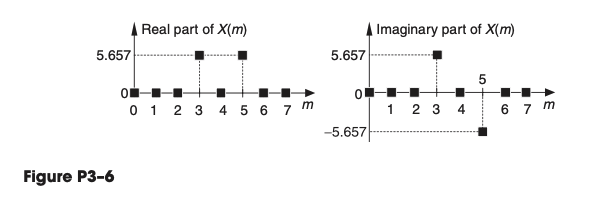
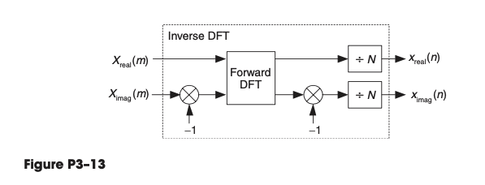
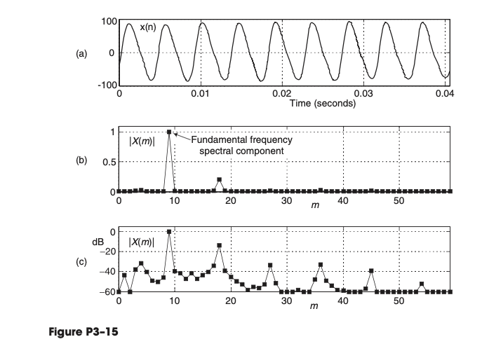
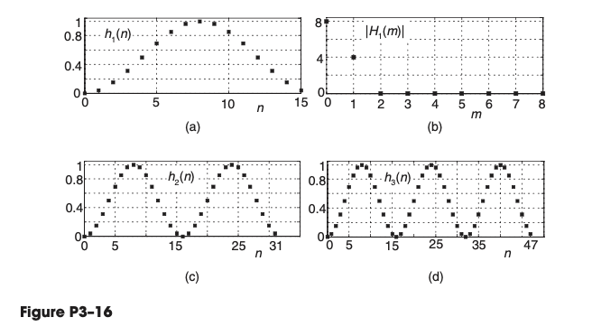
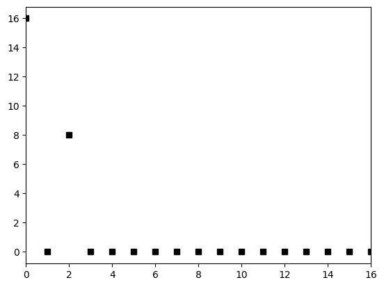
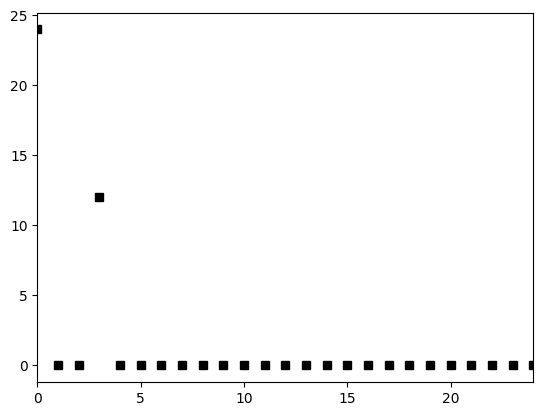
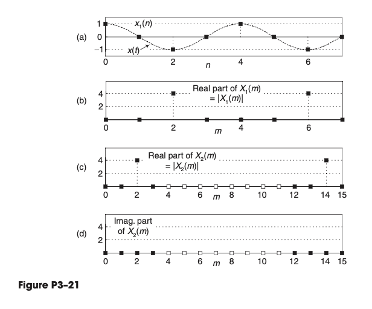
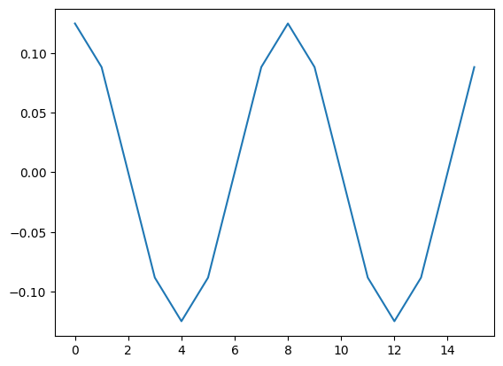

# Chapter 03 The Discrete Fourier Transform

## 3.1

Let’s assume that we have performed a 20-point DFT on a sequence 
of real-valued time-domain samples, and we want to send our $X(m)$ 
DFT results to a  colleague using e-mail. What is the absolute 
minimum number of (complex) frequency-domain sample values we will 
need to type in our e-mail so that our colleague has complete 
information regarding our DFT results?

**Solution**:

Since it is symmetric, we will just need send 10.

$\square$

## 3.2

Assume a systems engineer directs you to start designing a system 
that performs spectrum analysis using DFTs. The systems engineer 
states that the spectrum analysis system’s input data sample rate, 
$f_s$, is $1000$ Hz and specifies that the DFT’s frequency-domain sample spacing must be exactly $45$ Hz.

(a) What is the number of necessary input time samples, $N$, for a 
single DFT operation?

**Solution**:

If we want to achieve $45$ Hz, we know the DFT’s frequency spacing 
(resolution) is $f_s/N$.

So $f_s / N \leq 45$, then $N \geq 23$.

$\square$

(b) What do you tell the systems engineer regarding the spectrum 
analysis system’s specifications?

**Solution**:

The $f_s$ needs to be $900$ Hz.

$\square$

## 3.3

We want to compute an $N$-point DFT of a one-second-duration 
compact disc (CD) audio signal $x(n)$, whose sample rate is
$fs = 44.1$ kHz, with a DFT sample spacing of $1$ Hz.

(a) What is the number of necessary $x(n)$ time samples, $N$?

**Solution**: Again, we know the DFT’s frequency spacing 
(resolution) is $f_s/N$. So

$$ 
\frac{f_s}{N} = \frac{44100}{N} = 1
$$

Then $N = 441000$.

$\square$

(b) What is the time duration of the $x(n)$ sequence measured in 
seconds?
Hint: This Part (b) of the problem is trickier than it first 
appears. Think carefully.

**Solution**:

It should be

$$ 
1 \text{ second} \cdot \frac{44100 - 1}{44100} \approx 0.99997732
\text{ second}
$$

$\square$

## 3.4

Assume we have a discrete $x(n)$ time-domain sequence of samples 
obtained from lowpass sampling of an analog signal, $x(t)$.
If $x(n)$ contains $N = 500$ samples, and it was obtained at a 
sample rate of $f_s = 3000$ Hz:

(a) What is the frequency spacing of $x(n)$’s DFT samples, $X(m)$, 
measured in Hz?

**Solution**:

Again, it is

$$ 
\frac{f_s}{N} = \frac{3000}{500} = 6 \text{ Hz}
$$

$\square$

(b) What is the highest-frequency spectral component that can be 
present in the analog $x(t)$ signal where no aliasing errors occur 
in $x(n)$?

**Solution**:

The highest-frequency spectral component has to be $\leq \frac{f_s}
{2}$.

$\square$

(c) If you drew the full $X(m)$ spectrum and several of its 
spectral replications, what is the spacing between the spectral 
replications measured in Hz?

**Solution**:

I am not exactly sure. Let's say the original signal has the
frequency component of $1500 - 6 = 1494$ Hz. Then the spacing
between spectral replications is $(1500 + 6) - (1500-6) = 12$ Hz.

$\square$

## 3.5

What are the magnitudes of the 8-point DFT samples of

(a) the $x_1(n) = 9, 9, 9, 9, 9, 9, 9, 9$ sequence (explain how 
you arrived at your solution)?

**Solution**: We cannot apply the formula (3-17) because the
input does not contain a sine wave.

$$ 
M_r = \frac{A_o N}{2}
$$

So we have to directly use the FFT equation

$$ 
X(m) = \sum_{n = 0}^{N-1} x(n) e^{-j2πnm/N} \\
= 9 \sum_{n = 0}^{N-1} e^{-j2πnm/N} \\
=
\begin{cases}
    72 &\text{if } m = 0 \\
    0 &\text{if } m \neq 0 \\
\end{cases} 
$$

$\square$

(b) the $x_2(n) = 1, 0, 0, 0, 0, 0, 0, 0$ sequence (explain how 
you arrived at your solution)?

**Solution**:

$$ 
X(m) = \sum_{n = 0}^{N-1} x(n) e^{-j2πnm/N} \\
= x(0) = 1
$$

$\square$

(c) the $x_3(n) = 0, 1, 0, 0, 0, 0, 0, 0$ sequence (explain how 
you arrived at your solution)?

Because the $x_3(n)$ sequence in Part (c) is merely a time-shifted 
version of the $x_2(n)$ sequence in Part (b), comment on the 
relationship of the $|X_2(m)|$ and $|X_3(m)|$ DFT samples.

**Solution**:

Note $x_3(n) = x_2(n-1)$, so

$$ 
X_3(m) = e^{-j2πm/8} X_2(m)
$$

Then

$$ 
|X_3(m)| = |e^{-j2πm/8} X_2(m)| \\
= |X_2(m)| = 1
$$

$\square$

## 3.6

Consider sampling exactly three cycles of a continuous $x(t)$ 
sinusoid resulting
in an 8-point $x(n)$ time sequence whose 8-point DFT is the
$X(m)$ shown in Figure P3–6. If the sample rate used to obtain
$x(n)$ was 4000 Hz, write the time-domain equation for the 
discrete $x(n)$ sinusoid in trigonometric 
form. Show how you arrived at your answer.



**Solution**:

We can simply do a IDFT.
Note that $A = 8, X(3) = A e^{j(π/4)}, X(5) = A e^{-j(π/4)}$ 

$$
\begin{split}
x(n) &= \frac{1}{N} \sum_{m = 0}^{N-1} X(m) e^{j2πmn/N} \\
&= \frac{A}{8}
(e^{j(π/4 + 6πn/8)} + e^{-j(π/4 + 6πn/8)}) \\
&= \frac{A}{4}
\cos (\frac{3n+1}{4} \pi) \\
&= 2 \cos (\frac{3n+1}{4} \pi)
\end{split}
$$

The python code

```python
N = 8
n = np.arange(0, 8, 1)
A = 8
x = (A/4) * np.cos ((3*n+1)/4 * np.pi)
np.around(x, 4)

array([ 1.4142, -2.    ,  1.4142,  0.    , -1.4142,  2.    , -1.4142, -0.    ])

X = fft(x)
np.around(X, 4)

array([-0.    -0.j    , -0.    -0.j    , -0.    -0.j    ,  5.6569+5.6569j,
        0.    -0.j    ,  5.6569-5.6569j, -0.    +0.j    , -0.    +0.j    ])
```

$\square$

## 3.7

In the text’s Section 3.1 we discussed the computations necessary 
to compute the $X(0)$ sample of an $N$-point DFT. That $X(0)$ 
output sample represents the zero Hz (DC) spectral component of an 
$x(n)$ input sequence. Because it is the DC component, $X(0)$ is 
real-only and we’re free to say that an $X(0)$ sample always has 
zero phase. With that said, here are two interesting DFT problems:

(a) Given that an $N$-point DFT’s input sequence $x(n)$ is 
real-only, and $N$ is an even number, is there any value for $m$ 
(other than $m = 0$) for which an $X(m)$ DFT output sample is 
always real-only?

**Solution**

$$ 
X(m) = \sum_{n = 0}^{N-1} x(n) e^{-j2πnm/N} 
$$

If $N$ is an even number and $m = N / 2$, then

$$ 
e^{-j2πnm/N} = e^{-jπn} = \cos (πn) + i \sin (πn) = \pm 1
$$

Then $X(N/2)$ is real-only.

$\square$

(b) Given that $N$ is an odd number, is there any value for $m$ 
(other than $m = 0$) where an $X(m)$ DFT output sample is always 
real-only?

**Solution**:

From section 3.2, if that real input function is even, then $X(m)$ 
is always real and even.

$\square$

## 3.8

Using the following rectangular form for the DFT equation:

$$ 
X(m) = \sum_{n = 0}^{N-1} x(n) [\cos (2πnm/N) - j \sin(2πnm/N)] 
$$

$N$ is an even number, frequency $f_s$ is the $x(n)$ sequence’s sample 
rate in Hz, time index $n = 0, 1, 2, ..., N–1$, and $θ$ is an initial 
phase angle measured in radians.
Hint: Recall the trigonometric identity

$$
\sin(α+β) = \sin(α)\cos(β) + \cos(α)\sin(β)
$$

(a) Prove that the $f_s/2$ spectral sample is $X(N/2) = N · \sin(θ)$ 
when the $x(n)$ input is a sinusoidal sequence defined by

$$ 
x(n) = \sin[2π(f_s/2)nt_s + θ].
$$

**Proof**:

First note that the original analog waveform frequency should be
$f_s / 2$.

Then note, when $m = N/2$, then

$$ 
\cos (2πnm/N) = \cos (n \pi) = \pm 1\\
\sin (2πnm/N) = \sin (n \pi) = 0 \\
$$

Then

$$
\begin{split}
X(N/2) &= x(0) - x(1) + \cdots + x(N-2) - x(N-1) \\
&= \sin (0π + θ) - \sin (1π + θ) + \cdots + \sin ((N-2)π + θ) -
\sin ((N-1)π + θ) \\
&= N \sin (θ)    
\end{split}
$$

Note that this is also intuitively correct, when $θ = 0$, and
we sample at $f_s$ for a $f_s/2$ sine wave, we can only get 0.

$\square$

(b) What is $X(N/2)$ when $x(n) = \sin[2π(f_s/2)nt_s]$?

**Solution**: As mentioned in the end of part (a), it's 0.

$\square$

(c) What is $X(N/2)$ when $x(n) = \cos[2π(f_s/2)nt_s]$?

**Solution**:

Note $\cos t = \sin (t + π/2)$, so $θ = π/2$.

$$ 
X(N/2) = N \sin (θ) = N
$$

$\square$

## 3.9

To gain some practice in using the algebra of discrete signals and the 
geometric series identities in Appendix B, and to reinforce our 
understanding of the output magnitude properties of a DFT when its 
input is an exact integer number of sinusoidal cycles:

(a) Prove that when a DFT’s input is a complex sinusoid of magnitude
$A_o$ (i.e. $x(n) = e^{j2πfn t_s}$) with exactly three cycles over $N$ 
samples the output magnitude of the DFT’s
$m = 3$ bin will be $|X(3)| = A_o N$.

Hint: The first step is to redefine $x(n)$’s $f$ and $t_s$ variables in 
terms of a sample rate $f_s$ and $N$ so that $x(n)$ has exactly three 
cycles over $N$ samples. The redefined $x(n)$ is then applied to the 
standard DFT equation.

**Proof**:

Note that $N t_s f = 3$, so $f t_s = \frac{3}{N}$. Then

$$ 
e^{j2πfn t_s} = e^{j2π n 3 / N}
$$

Then

$$
\begin{split}
X(m) &= A_o \sum_{n = 0}^{N-1} x(n) e^{-j2πnm/N} \\
&= A_o \sum_{n = 0}^{N-1} e^{j2π n 3 / N} e^{-j2πnm/N} \\
&= A_o \sum_{n = 0}^{N-1} e^{j2π (3-m) n / N} \\
\end{split}
$$

So when $m = 3$,

$$ 
X(3) = A_o \sum_{n = 0}^{N-1} e^{j2π 0 n / N}
= A_o N
$$

$\square$

(b) Prove that when a DFT’s input is a real-only sinewave of peak 
amplitude $A_o$ (i.e., $x(n) = A_o \sin(2πfnt_s)$) with exactly three cycles over $N$ samples, the
output magnitude of the DFT’s $m=3$ bin will be $|X(3)|= A_o N/2$.

Hint: Once you redefine $x(n)$’s $f$ and $t_s$ variables in terms of a 
sample rate $f_s$ and $N$ so that $x(n)$ has exactly three cycles over 
$N$ samples, you must convert that real sinewave to complex exponential 
form so that you can evaluate its DFT for $m = 3$.

**Solution**:

Note

$$
\begin{split}
x(n) &= A_o \sin(2πfnt_s) \\
&= A_o \frac{e^{j2πfn t_s} - e^{-j2πfn t_s}}{2j} \\
&= A_o \frac{e^{j2πn 3 / N} - e^{-j2πn 3 / N}}{2j} \\
\end{split}
$$

So

$$ 
\begin{split}
X(3) &= \sum_{n = 0}^{N-1} x(n) e^{-j2πn3/N} \\
&= \frac{A_o}{2j} \sum_{n = 0}^{N-1} (e^{j2πn 0 / N} - e^{-j12πn / N}) \\
&= \frac{A_o}{2j} \sum_{n = 0}^{N-1} (1 - e^{-j12πn / N})
\end{split}
$$

Now use results in Appendix B

$$ 
\sum_{n = 0}^{N-1} e^{-j12πn / N} =
\frac{1 - e^{-j12π}}{1 - e^{-j12π / N}} \\
= 0
$$

So $X(3) = \frac{N A_o}{2j}$, so $|X(3)| = \frac{A_o N}{2}$.

$\square$

## 3.10

Consider performing the 5-point DFT on the following $x_1(n)$ 
time-domain samples

$$ 
x_1(n) = [1, 2.2, –4, 17, 21],
$$

and the DFT’s first sample is $X_1(0) = 37.2$. Next, consider 
performing the 5-point DFT on the following $x_2(n)$ time samples

$$ 
x_2(n) = [1, 2.2, –4, 17, Q],
$$

and that DFT’s first sample is $X_2(0) = 57.2$. What is the value 
of $Q$ in the $x_2(n)$ time sequence? Justify your answer.

**Solution**:

$$ 
X(m) = \sum_{n = 0}^{N-1} x(n) e^{-j2πnm/N} 
$$

So

$$ 
X(0) = \sum_{n = 0}^{N-1} x(n)
$$

So $Q = 57.2 - (1 + 2.2 -4 +17) = 41$.

$\square$

## 3.11

Derive the equation describing $X(m)$, the $N$-point DFT of the following $x(n)$ sequence:

$$ 
x(n) = a^n, \qquad \text{for} 0 \leq n \leq N-1.
$$

Hint: Recall one of the laws of exponents, $p^bq^{bc} = (pq^c)^b$, and the geometric series identities in Appendix B.

**Solution**:

$$
\begin{split}
X(m) &= \sum_{n = 0}^{N-1} x(n) e^{-j2πnm/N} \\
&= \sum_{n = 0}^{N-1} a^n e^{-j2πnm/N} \\
&= \sum_{n = 0}^{N-1} (a e^{-j2πm/N})^n \\
&= \frac{1 - a^N e^{-j2πm}}{1 - a e^{-j2πm/N}}
\end{split}
$$

$\square$

## 3.12

Consider an N-sample $x(n)$ time sequence whose DFT is represented by $X(m)$,
where $0 \leq m \leq N–1$. Given this situation, an Internet website once stated,
“The sum of the $X(m)$ samples is equal to $N$ times the first $x(n)$ sample.” Being
suspicious of anything we read on the Internet, show whether or not that
statement is true.

Hint: Use the inverse DFT process to determine the appropriate $x(n)$ time
sample of interest in terms of $X(m)$.

**Solution**:

The IDFT shows

$$ 
x(n) = \frac{1}{N} \sum_{m = 0}^{N-1} X(m) e^{j2πmn/N} 
$$

Plug $n = 0$ into it

$$ 
x(0) = \frac{1}{N} \sum_{m = 0}^{N-1} X(m) e^{j2πm0/N} \\
= \frac{1}{N} \sum_{m = 0}^{N-1} X(m) \\
\Rightarrow \\
\sum_{m = 0}^{N-1} X(m) = N x(0) \\
$$

$\square$

## 3.13

Here is a problem whose solution may be useful to you in the future. On the
Internet you will find information suggesting that an inverse DFT can be
computed using a forward DFT software routine in the process shown in Figure P3–13.



(a) Using the forward and inverse DFT equations, and the material in Appendix A,
show why the process in Figure P3–13 computes correct inverse DFTs.

Hint: Begin your solution by writing the inverse DFT equation and conjugating
both sides of that equation.

**Solution**:

$$ 
x(n) = \frac{1}{N} \sum_{m = 0}^{N-1} X(m) e^{j2πmn/N} \\
$$

Note that

$$
\begin{split}
\left( X(m) e^{j2πmn/N} \right)^* 
&= X^*(m) e^{-j2πmn/N} \\
&= (X_{\text{real}}(m) - X_{\text{imag}}(m)) e^{-j2πmn/N} \\
\end{split}
$$

We have to assume $X(m)$ is symmetric. If so
Then

$$ 
\sum_{m = 0}^{N-1} X_{\text{real}}(m) e^{-j2πmn/N}
\quad
\text{is real} \\
\sum_{m = 0}^{N-1} X_{\text{imag}}(m) e^{-j2πmn/N}
\quad
\text{is pure imaginary} \\
$$

So

$$ 
\frac{1}{N} \sum_{m = 0}^{N-1} X_{\text{real}}(m) e^{-j2πmn/N}
= x_{\text{real}}(n) \\
\frac{1}{N} \sum_{m = 0}^{N-1} X_{\text{imag}}(m) e^{-j2πmn/N}
= x_{\text{imag}}(n) \\
$$

$\square$

(b) Comment on how the process in Figure P3–13 changes if the 
original frequency-domain $X(m)$ sequence is conjugate symmetric.

**Solution**:

Then there will be no $x_{\text{imag}}(n)$, only
$x_{\text{real}}(n)$ left.

$\square$

## 3.15

Here is a real-world spectrum analysis problem. Figure P3–15(a) shows 902
samples of an $x(n)$ time sequence. (For clarity, we do not show the $x(n)$ sam-
ples as individual dots.) That sequence is the sound of the “A3” note (“A”
below middle “C”) from an acoustic guitar, sampled at $f_s = 22.255 kHz$. Figure
P3–15(b) shows the $X(m)$ spectral magnitude samples, the DFT of $x(n)$, on a
linear scale for the frequency index range of $0 \leq m \leq 59$.

(a) Based on the $X(m)$ samples, what is the fundamental frequency, in Hz, of
the guitar’s “A3” note?

**Solution**

$$ 
f_o = \frac{m}{N} f_s = \frac{9}{902} 22.255 \approx 222.06 Hz
$$

$\square$

(b) When we plot the DFT magnitude samples on a logarithmic scale, as in
Figure P3–15(c), we see spectral harmonics and learn that the guitar note is
rich in spectral content. (The harmonics are integer multiples of the fun-
damental frequency.) That’s why guitars have their pleasing sound, de-
pending on the guitarist’s skill, of course. What is the frequency of the
highest nonzero spectral component of the guitar’s “A3” note?

**Solution**

It's

$$ 
f_o = \frac{2m}{N} f_s = \frac{18}{902} \times 22.255 \approx 444.11 Hz
$$

$\square$



## 3.16

Figure P3–16(a) shows a 16-point Hanning window sequence, $h_1(n)$, defined by

$$ 
h_1(n) = 0.5 - 0.5 \cos (\frac{2 \pi n}{16}), \quad\text{for } n = 0,1,2,\cdots ,
$$

The magnitude of its DFT samples, $|H_1(m)|$, is shown in Figure P3–16(b).
(For simplicity, we show only the positive-frequency range of the $|H_1(m)|$
samples.) Notice that only the $|H_1(0)|$ and the $|H_1(1)|$ frequency-domain
samples are nonzero.



(a) Sequence $h_1(n)$ comprises two signals. Looking carefully at $h_1(n)$, describe
what those two signals are and justify why $|H_1(m)|$ looks the way it does.

**Solution**:

One is the DC component, the other is $\frac{1}{16} f_s$ component.

$\square$

(b) Given your understanding of the relationship between $h_1(n)$ and $|H_1(m)|$,
look at $h_2(n)$, in Figure P3–16(c), which is two repetitions of the original
$h_1(n)$ sequence. Draw a rough sketch of the spectral magnitude sequence
$|H_2(m)|$ over its positive-frequency range.

**Solution**:

Because $h_2(n) = h_1(n)$.

$$ 
h_2(n) = h_1(n) = 0.5 - 0.5 \cos (\frac{2 \pi n}{16}) \\
= 0.5 - 0.5 \cos (2 \pi n \frac{2}{32})
$$

So it is

$$ 
|H_2(m)| =
\begin{cases}
    16 &\text{if } m = 0 \\
    8 &\text{if } m = 2\\
    0 &\text{otherwise }\\
\end{cases} 
$$

Confirmed with plot here:



$\square$

---

(c) Given that the $h_3(n)$ in Figure P3–16(d) is three
repetitions of the original
$h_1(n)$ sequence, draw the spectral magnitude sequence
$|H_3(m)|$ over its positive-frequency range.

**Proof**:

$$ 
h_3(n) = h_1(n) = 0.5 - 0.5 \cos (\frac{2 \pi n}{16}) \\
= 0.5 - 0.5 \cos (2 \pi n \frac{3}{48})
$$

$$ 
|H_3(m)| =
\begin{cases}
    24 &\text{if } m = 0 \\
    12 &\text{if } m = 3\\
    0 &\text{otherwise }\\
\end{cases} 
$$

Confirmed with plot here:



(d) Considering the $h_1(n)$, $h_2(n)$, and $h_3(n)$ sequences, and
their $|H_1(m)|$, $|H_2(m)|$, and $|H_3(m)|$ spectral magnitude samples,
complete the following important statement:
"$K$ repetitions of an $h_1(n)$ sequence result in an
extended-length time sequence whose spectral magnitudes have $K–1$ ..."

**Solution**:

It should be "$K$ repetitions of an $h_1(n)$ sequence result in an
extended-length time sequence whose spectral magnitudes have $K–1$ zeros
between the DC component of the first nonzero component".

More complete answers from Opus 4.8:

"$K$ repetitions of an $h_1(n)$ sequence result in an extended-length time sequence 
whose spectral magnitudes have $K-1$ zero-valued samples between each pair of 
consecutive nonzero spectral samples."

$\square$


## 3.17

In the literature of DSP, you may see an alternate expression for an N-point
Hanning window defined by

$$ 
w_{\text{han,alt}} =
\sin ^2 \left( 
\frac{\pi n}{N}
 \right), \text{ for } n = 0, 1, 2, \cdots, N-1
$$

Prove that the above alternate expression for a Hanning window is equiva-
lent to the Section 3.9 text’s definition of a Hanning window.

**Proof**:

Section 3.9 defines Hanning window as

$$ 
w(n) = 0.5 - 0.5 \cos \left( 
\frac{2 \pi n}{N}
 \right),
\text{ for } n = 0, 1, 2, \cdots, N-1
$$

We will use the Trigonometric Identities

$$ 
\cos A - \cos B = - 2 \sin \frac{A+B}{2} \sin \frac{A-B}{2}
$$

And note $1 = \cos 0$.

So

$$ 
\begin{align*}
w(n) &= 0.5 - 0.5 \cos \left( 
\frac{2 \pi n}{N}
 \right) \\
 &= 0.5 (\cos 0 - \cos \frac{2 \pi n}{N}) \\
 &= - \sin (-\frac{ \pi n}{N}) \sin (\frac{ \pi n}{N}) \\
 &= \sin ^2 \left( 
\frac{\pi n}{N}
 \right)
\end{align*} 
$$

$\square$

## 3.18

Considering the DFT of an $N$-point $x(n)$ sequence,
what is the spectral effect
of zero-padding the $x(n)$ sequence to a length of $Q$
samples (with $Q$ being an
integer power of two, and $Q > N$)
and performing a $Q$-point DFT on the zero-padded sequence?

**Solution**:

Assume $x(n)$ has a component for

$$ 
\frac{m}{N} f_s
$$

Then if we zero padded to $Q$ samples, then $Q$-point DFT have at

$$ 
k = \frac{mQ}{N}
$$

---

Here is the answer from AI:

Zero-padding an N-point sequence to Q points and taking a Q-point DFT has two key effects:

What it does — spectral interpolation: The bin spacing shrinks from $f_s/N$ to $f_s/Q$, giving more DFT samples of the same underlying DTFT. The spectrum looks smoother and more detailed. A component at bin $m$ shifts to bin $k = mQ/N$.

What it does NOT do — resolution is unchanged: Two sinusoids closer than $f_s/N$ apart still cannot be separated. True frequency resolution is determined by $N$ (the amount of real data), not $Q$.

See also the `3.18` in `ex03.ipynb`.

$\square$

## 3.19

Assume that an $N$-point DFT, performed on an $N$-sample $x(n)$ time-domain
sequence, results in a DFT frequency-domain sample spacing of $100$ Hz. What
would be the DFT frequency-domain sample spacing in Hz if the $N$-sample
$x(n)$ time sequence was padded with 4$N$ zero-valued samples and we per-
formed a DFT on that extended-time sequence?

**Solution**:

Since the number of sample increases from $N$ to $N + 4N = 5N$, the
frequency-domain sample spacing becomes

$$
\begin{align*}
\frac{f_s}{5N} &=
\frac{1}{5} \frac{f_s}{N} \\
&= 100 / 5 \\
&= 20 Hz
\end{align*}  
$$

$\square$

## 3.20

There is a program, in the U.S. and other countries, called “Search for Ex-
traterrestrial Intelligence” (SETI). These folk point radio antennas around in
the night sky searching for “nonrandom radio” signals, hoping to find evidence of “little green men.”
They search for radio-frequency (RF) signal energy that significantly exceeds the
background RF noise energy in the sky.
Their primary method for detecting low-level RF energy is to tune a narrow-
band receiver to some RF frequency and collect millions of time-domain sam-
ples, and then perform million-point DFTs in the hope of finding spectral
magnitude components that significantly exceed the background spectral
noise. High-level spectral components would indicate the existence of intelli-
gent life that’s broadcasting radio signals of some sort.
Here’s the question: If a SETI researcher collects one million time sam-
ples and performs a one-million-point DFT, roughly what DFT processing
gain (in dB) improvement can that person expect to achieve in pulling a weak
spectral component up above the background galactic spectral noise in comparison to using a 100-point DFT?

**Solution**:

Since the $DFT$ amplitude is proportional to $N$, then the processing gain
is

$$ 
20 \log_{10} \frac{1000000/\sqrt[]{1000000}}{100/\sqrt[]{100}} = 20 \log_{10} \frac{1000}{10} = 40 \text{ dB}.
$$

$\square$

## 3.21

This problem tests your understanding of the DFT’s frequency-domain axis.
Consider sampling exactly two cycles of an analog $x(t)$ cosine wave resulting
in the $8$-point $x_1(n)$ time sequence in Figure P3–21(a). The real part of the DFT
of $x_1(n)$ is the sequence shown in Figure P3–21(b). Because $x_1(n)$ is exactly two
cycles of a cosine sequence, the imaginary parts of $X_1(m)$ are all zero-valued
samples, making $|X_1(m)|$ equal to the real part of $X_1(m)$. (Note that no leak-
age is apparent in $|X_1(m)|$.) Think, now, of a new frequency-domain se-
quence $X_2(m)$ that is equal to $X_1(m)$ with eight zero-valued samples, the white
squares in Figures P3–21(c) and P3–21(d), inserted in the center of the real
and imaginary parts of $X_1(m)$.



(a) Draw the $x_2(n)$ time sequence that is the inverse DFT of $X_2(m)$.

**Solution**:

Here is the code to draw $x_2(n)$.

```python
N = 16
n = np.arange(N)
X = np.where((n == 2) | (n == 14), 1, 0)
x = np.real(ifft(X))
plt.plot(n, x)
```

And here is the result



(b) Comment on how the $x_2(n)$ time sequence is related to the original analog
$x(t)$ signal and the $x_1(n)$ sequence.

**Solution**:

$x_2(n)$ is sampling the original analog $x(t)$ signal with double the sampling frequency.

The relation between $x_1(n)$ and $x_2(n)$ is

$$ 
x_1(n) = x_2(2n), n = 0, \cdots, 7
$$

---

I have some confusion about why we cannot use the same $f_s$ to sample a $y(t)$ is half the frequency?

Then $x_2(n)$ and the $X_2(m)$ would be the same.

Here is some answers from Opus-4.8

**Why that picture is physically false**

The decisive point: we never collected any new data. We had 8 real 
samples. We took their spectrum $X_1(m)$, mathematically inserted zeros, 
and inverse-transformed. No antenna went back out and gathered 16 samples.

* You cannot "sample 2X the data" by typing zeros into an array — that 
would be manufacturing information you don't have.
* The inserted values are **zeros in the frequency domain** = no new 
  spectral content. That's the signature of resampling existing data, not 
  measuring new data.

So the 16 numbers can only be a denser representation of the same 8 
samples over the same time window → same duration, double the sample 
rate, same analog $x(t)$. That's interpolation.

**The subtle part: the numbers are identical either way**

Here's what makes your reading tempting. The sequence $x_2(n) = \cos(\pi n/4)$ is just a list of 16 numbers. Those numbers are the same whether you call them:

* (A, correct): the $f_s/4$ signal sampled at rate $2f_s$, or
* (B, yours): an $f_s/8$ (half-freq) signal sampled at rate $f_s$.

The arithmetic can't distinguish them — only the physical setup can. And the setup is fixed: we manipulated the spectrum of one specific signal, the original $x(t)$. Part (b) literally asks how $x_2$ relates to that $x(t)$. Interpretation B invents a different analog signal that was never in the problem; interpretation A keeps $x(t)$ and explains $x_2$ as its interpolation — which is why $x_1(n) = x_2(2n)$ falls out (the original samples survive at the even indices, untouched).

One-line test you can keep: zero-stuffing in frequency adds no information, so it can only interpolate existing data (more samples, same span, higher rate) — it can never extend it (more span at the same rate), because extending would require data you never collected.

So the corrected statement: frequency-domain zero-stuffing can interpolate (new sample values, no new information) but can't extend the observation window (which would require new information the original samples don't contain). Your "$2f_s$ collects new data" is true for the values, but those values were already implied — which is exactly why the DFT could manufacture them for free.

This is also the mirror image of 3.18/3.19: there, zero-padding in time interpolates the spectrum (more bins, no new resolution); here, zero-stuffing in frequency interpolates the time signal (more samples, no new information). Same principle, axes swapped.

$\square$
